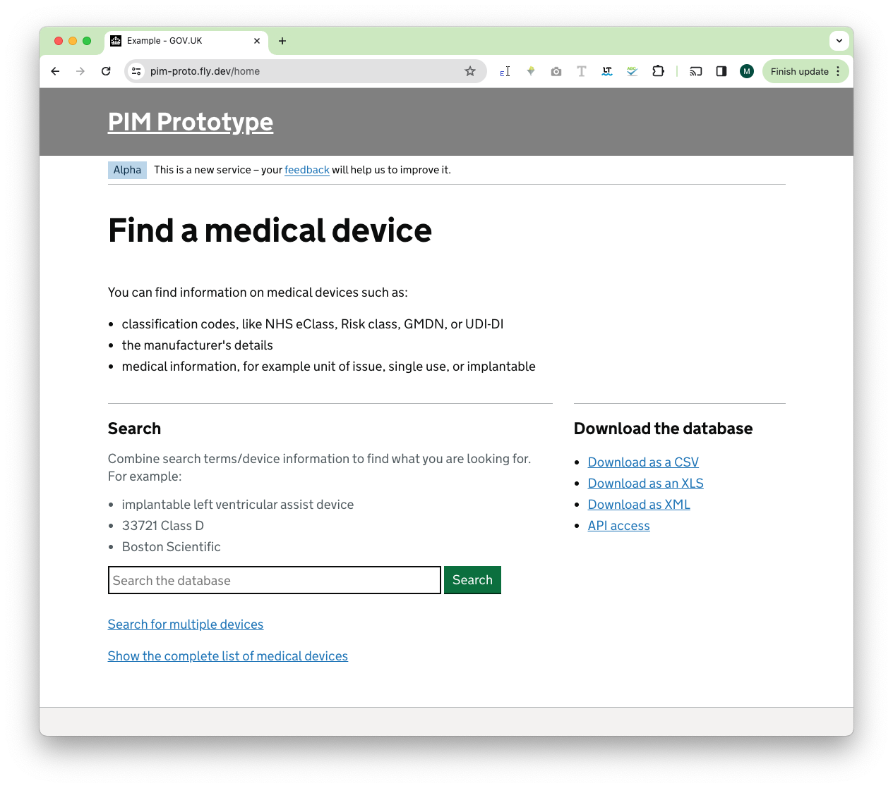

# Weekly report

## What we did last week

- Document attempts to match MHRA data directly with GUDID
- Improve search to include GMDN terms

## What we’re planning to do this week

- Add cleansing scripts and documentation to code repository
- Add quality analysis queries to code repository
- Assess record improvement of MHRA data using GUDID
- Draft and send out data consumers survey
- Identify best approach to API provision
- Investigate field validations in the MHRA dataset 
- Investigate external catalogue provider technologies
- Merge GUDID and MHRA data into a single SQLite db
- Plan manufacturer workshop for Sprint 4
- Test coded prototype with data consumers

## Goals

These were the goals that we had last week:

- Get the dynamic search and view dynamic prototype ready _**Done**_

These are the goals that we have this week:

- Get better data for analysis and prototyping
_**In progress**_

- Understanding users responses to the coded prototype
_**In progress**_

- Widen our participant pool
_**In progress**_

## These are are currently identified risks and issues

- \[Issue\] Different people building different overlapping systems
- \[Issue\] What constitutes a medical device? How can we decide what is
included and excluded from PIM
- \[Risk\] Final ownership
- \[Risk\] Lack of Engagement from manufacturers in a maintenance process
- \[Risk\] NHS trust infrastructure to be able to consume data from PIM
- \[Risk\] Quality of Data - beyond our control
- \[Risk\] User availability

## Screenshot of current PIM prototype

