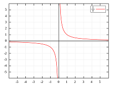

## What we did last week

- Initial architecture discussion
- Ways of working meeting
- Project board set up

## What we’re planning to do this week

- Conduct a data architecture review
- Set up a separate Azure environment for Marvell
- Initial / High level stakeholder map

## Goals

These are our goals for this sprint

- Have a service in Azure that we can demo _**In progress**_
- Understand the existing data process better _**In progress**_
- Agree the scope for Alpah _**In progress**_
- Document high level architecture and Azure products _**In progress**_
- Create an initial research plan _**Done**_
- Review discovert outputs _**Done**_

## Things to bear in mind

- The project started Tuesday 6th February
- This is our first weekly report

