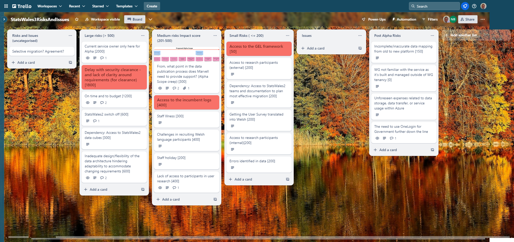
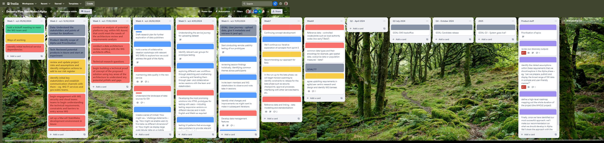

## What we did last week

- Conduct an analysis of potential platforms (e.g., within MS Azure)
- Is this service applicable for a service assessment?
- Initial / High level stakeholder map
- Set up a separate Azure environment for Marvell.
- Conduct a data architecture review
- Explore data storage and analysis options within Azure

## What we’re planning to do this week

- Build backlog of user stories in Azure
- Create a plan for prototype testing
- Design exploration - what first after user story review?
-  Disseminate the survey to the data publishers.
- Examination of lookup tables and identification of those that overlap
- Get data consumer survey translated into Welsh
- IaC a data lake
-  Mapping data on the current service
- Pilot data processor feedback survey with two participants
- Plan testing of the alpha prototype
- Recruit participants for testing the alpha prototype
- Request access to disaster recovery for Statswales2
- automate infrastructure as code for publishing app

## Goals

These are our goals for this sprint

- Agree the scope for Alpha _**In progress**_
- Document high level architecture and Azure products _**In progress**_
- Data: start to structure/analyse data in Azure once there is some in there _**In progress**_
- Have a service in Azure that we can demo _**Done**_
- Understand the existing data process better _**Done**_

## Things to bear in mind
- Transfer of SC clearance is *still* currently a limiting factor on progress

## Screen shot of risks and issues board

## Chart showing risk impact

## Screenshot of delivery plan

