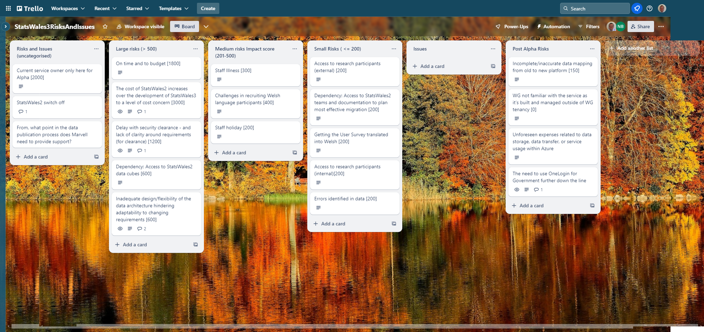
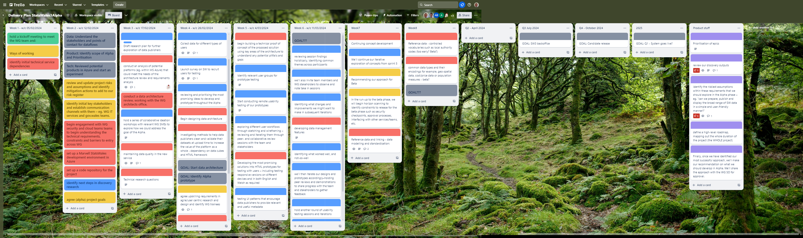

## What we did last week

- Conduct an analysis of potential platforms (e.g., within MS Azure)
- Is this service applicable for a service assessment?
- Initial / High level stakeholder map
- Set up a separate Azure environment for Marvell.
- Conduct a data architecture review
- Explore data storage and analysis options within Azure

## What we’re planning to do this week

- 3 surveys - data processor, data publisher, data consumer
- Create a plan for prototype testing
- User story map
- Build backlog of user stories in Azure
- Design exploration - what first after user story review?
- Have a walkthrough of the existing data process
- Disseminate the survey to the data publishers and data processors.
- Document and share initial architecture
- Request access to disaster recovery for Statswales2

## Goals

These are our goals for this sprint

- Understand the existing data process better _**In progress**_
- Agree the scope for Alpha _**In progress**_
- Document high level architecture and Azure products _**In progress**_
- Data: start to structure/analyse data in Azure once there is some in there _**In progress**_
- Have a service in Azure that we can demo _**Done**_

## Things to bear in mind
- Transfer of SC clearance is currently a limiting factor on progress

## Screen shot of risks and issues board

## Screenshot of delivery plan 

