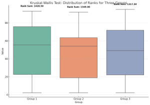
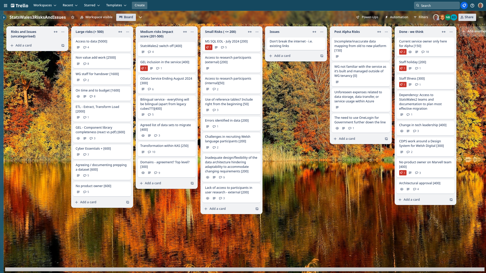
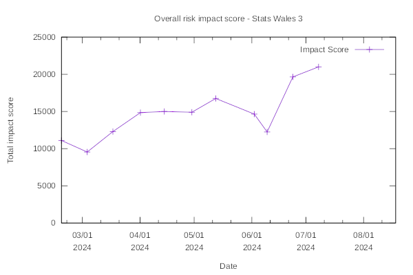

Weekly report
=============

Kruskall-Wallace test
----------------------

What we did last week
---------------------

- Hold workshop to review toolkit for bilingual software and develop action plan
- Review high-level plan for research in Beta

What we're planning to do this week
-----------------------------------

- [SPIKE] Explore react front-end for the app
- Formalise options for updating data table (append or replace etc)
- Happy path user flow for updating a dataset
- Identify and interrogate list of update scenarios
- [SPIKE] Data access strategy
- Recommendations and next steps from round 3 testing
- Guidance to publishers
- Data domain model
- Data audit for data migration 
- Register Dynamics - Cyber Essentials Plus
- Proposed approach for footnotes including missing values
- Implement auth into relevant services

Goals
-----

These are the goals that we set for this sprint:

- Authorisation for the service (development) 
 _**In progress**_

- Agree TO BE update dataset user journey - minimum viable product (research and design)
 _**In progress**_

Things to bear in mind / What's blocking us
-------------------------------------------

The following things are still blocking the progress of the project

- Access to the source data
*** We have access to the data on a virtual machine and are still working
to get a full, editable cut of the data which we require for migration***

- Agreement on access for Marvell subcontractors
***Register Dynamics are currently in discussion with the auditors to gain certification***

- Architecture form - Azure subscriptions
***We do not yet have permission to access the Welsh government Azure estate***

Screen shot of risks and issues board
-------------------------------------

