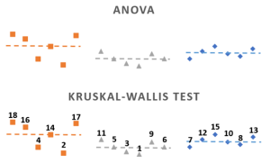
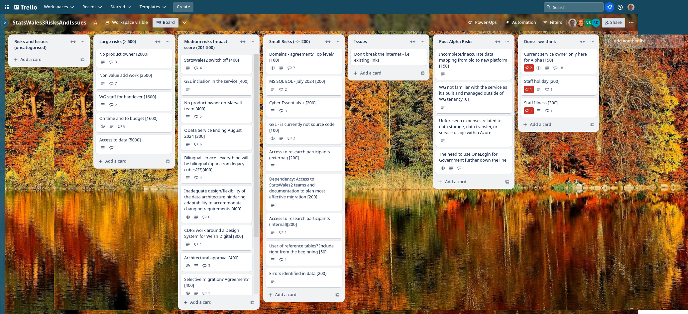

Weekly report
=============

Kruskall-Wallace test
------------------------------

What we're planning to do this week
-----------------------------------

- Formalise options for updating data table (append or replace etc)
- Happy path user flow for updating a dataset 
- Identify and interrogate list of update scenarios
- [SPIKE] Data access strategy
- Recommendations and next steps from round 3 testing
- Data domain model
- Data audit for data migration 
- Register Dynamics - Cyber Essentials Plus
- Hold workshop to review toolkit for bilingual software and develop action plana
- Proposed approach for footnotes including missing values
- Implement auth into relevant services
  Goals

-----------------------------------

These are the goals that we set for this sprint:

- Authorisation for the service (development)
  _**In progress**_

- Agree TO BE update dataset user journey - minimum viable product (research
  and design)
  _**In progress**_

Things to bear in mind / What's blocking us
-------------------------------------------

The following things are still blocking the progress of the project

- Access to the source data
  ***We now have access to the data on a machine which is available to the team. Ultimately we will still need download access to the data***

- Agreement on access for Marvell subcontractors (Cyber Essentials Plus)
  ***certification is expected by the end of the week - the audit is booked***

- Azure subscriptions
  ***Azure is still TBC - our SDD was updated to reflect a few more questions***

Screen shot of risks and issues board
-------------------------------------

