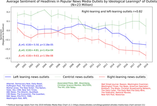
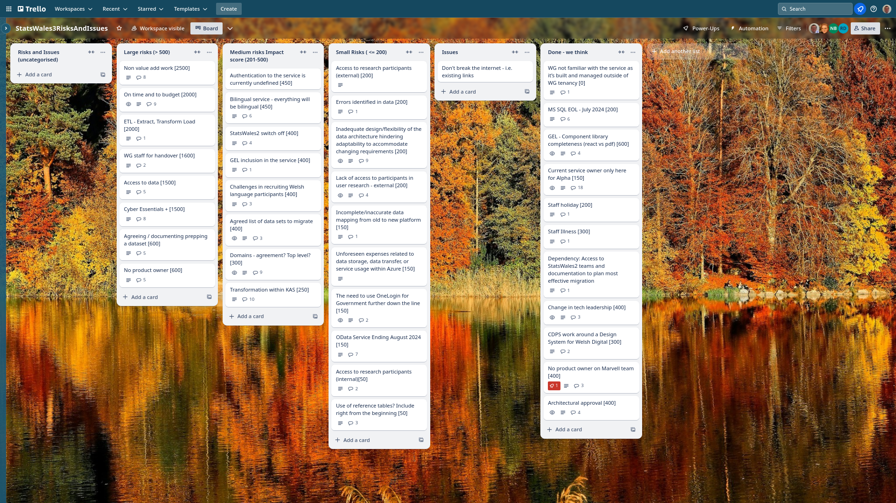
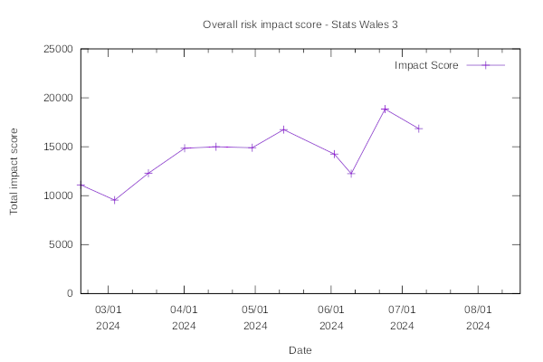

Weekly report
=============

Longtitudinal study
------------------------------

What we did last week
------------------------

- Create stimulus for update journey research
- Proposed approach for footnotes including missing values

What we're planning to do this week
-----------------------------------

- Implement hierarchies - alongside geography table
- Stand up the service in WG Azure
- Review the spreadsheet coming out of Bilingual toolkit discussion
- Happy path user flow for updating a dataset
- [SPIKE] Data access strategy [On Hold 11/07/20234]
- Plan the next round of research
- Data domain model
- Data audit for data migration 
- Register Dynamics - Cyber Essentials Plus
- Implement Successful upload confirmation (data table preview)

-----------------------------------

These are the goals that we set for this sprint:

- Prepare to test candidate options for update dataset user journey (research and design)
  _**In progress**_

- Complete publish a dataset up to task list with stories up to metadata (development)
  _**In progress**_

Things to bear in mind / What's blocking us
-------------------------------------------

The following things are still blocking the progress of the project

- Access to the source data
  ***We are waiting to take a cut of the data that we should be able to use to inform further work, especially migration***

- Agreement on access for Marvell subcontractors (Cyber Essentials Plus)
  ***CE+ audit booked by RD for Friday 26th July***

- Azure subscriptions
 ***We now have the access we need to the WG Azure estate***

Screen shot of risks and issues board
-------------------------------------

Risk impact chart
-------------------------------------

