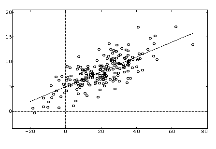
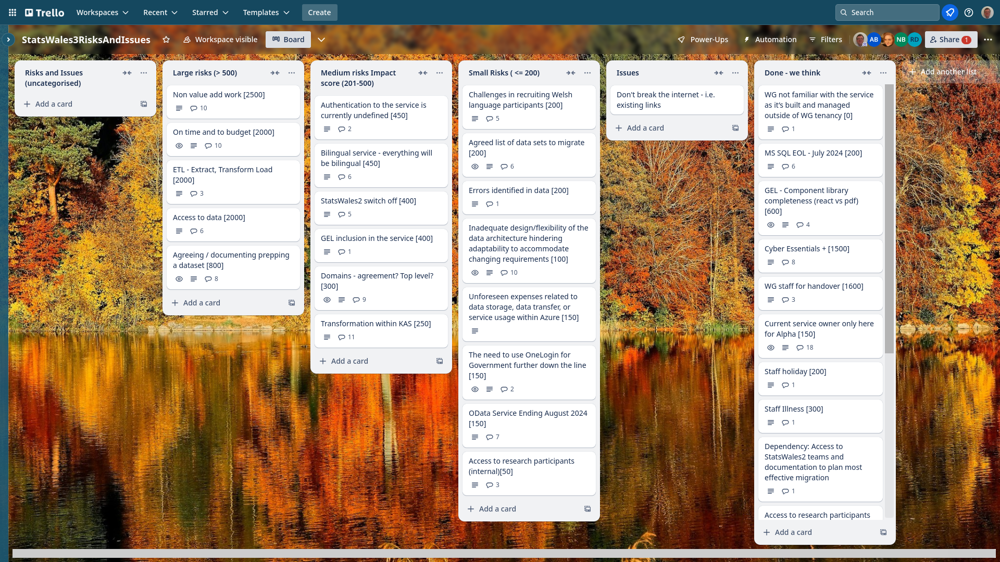
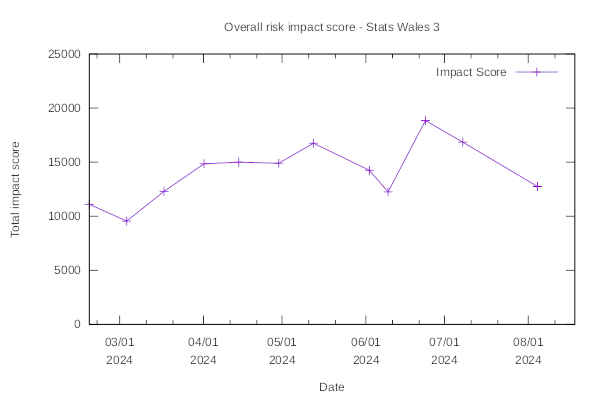

Weekly report
=============

Longtitudinal study
------------------------------

What we did last week
------------------------

- Analyse findings from workshops with publishers & agree next steps
- Hold review workshops with publishers to test options for making updates to a dataset
- Try to construct a csv from changing OData
- Register Dynamics - Cyber Essentials Plus
- Implement auth into relevant services

What we're planning to do this week
-----------------------------------

- Stand up the service in WG Azure
- Plan and conduct tree test of topics taxonomy (publishers and data consumers)
- [SPIKE] Data access strategy [On Hold 11/07/2024]
- Data domain model
- Data audit for data migration 
- Implement Successful upload confirmation (data table preview)

Sprint goals
-----------------------------------

These are the goals that we set for this sprint:

- Complete "publish a dataset" up to metadata (development)
  _**In progress**_

- Converge on approach for the update journey (research and design)
  _**In progress**_

- Azure pipeline in WG estate (development)
  _**In progress**_

Things to bear in mind / What's blocking us
-------------------------------------------

The following things are still blocking the progress of the project

- Access to the source data
  ***A data archive file was provided, but did not contain the data that was anticipated, we are continuing discussions to obtain the correct file***
- Azure subscriptions
  ***We have subscription. We will have the pipeline very soon***

Screen shot of risks and issues board
-------------------------------------

Risk impact chart
-------------------------------------

