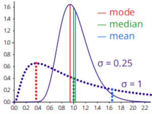
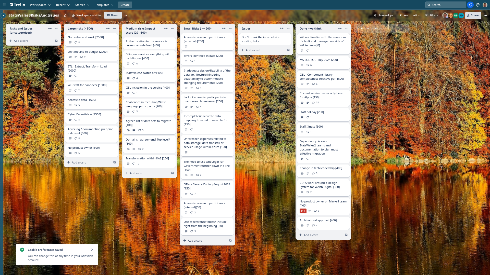

Weekly report
=============

Mean Average
------------------------------

What we did last week
------------------------

- Create stimulus for update journey research
- Review the spreadsheet coming out of Bilingual toolkit discussion
- Plan research to review options for the update user journey
- Proposed approach for footnotes including missing values
- Implement 'Create a new dataset' page

What we're planning to do this week
-----------------------------------

- Hold review workshops with publishers to test options for making updates to a dataset
- Implement hierarchies - alongside geography table
- Stand up the service in WG Azure
- Happy path user flow for updating a dataset
- [SPIKE] Data access strategy [On Hold 11/07/2024]
- Data domain model
- Data audit for data migration 
- Register Dynamics - Cyber Essentials Plus
- Implement Successful upload confirmation (data table preview)

-----------------------------------

These are the goals that we set for this sprint:

- Prepare to test candidate options for update dataset user journey (research and design)
  _**In progress**_

- Converge on approach for the update journey
  _**In progress**_

- Azure pipeline in WG estate
  _**In progress**_

Things to bear in mind / What's blocking us
-------------------------------------------

The following things are still blocking the progress of the project

- Access to the source data
  ***Data sharing agreement is shared and back with the Welsh Gov to finally provide us with the data***

- Agreement on access for Marvell subcontractors (Cyber Essentials Plus)
  ***This is no longer a blocker, our subcontractrs have the relevant certification***

- Azure subscriptions
  ***Marvell working to establish pipelines in Azure in order to begin migration of the service into the WG estate.***

Screen shot of risks and issues board
-------------------------------------

