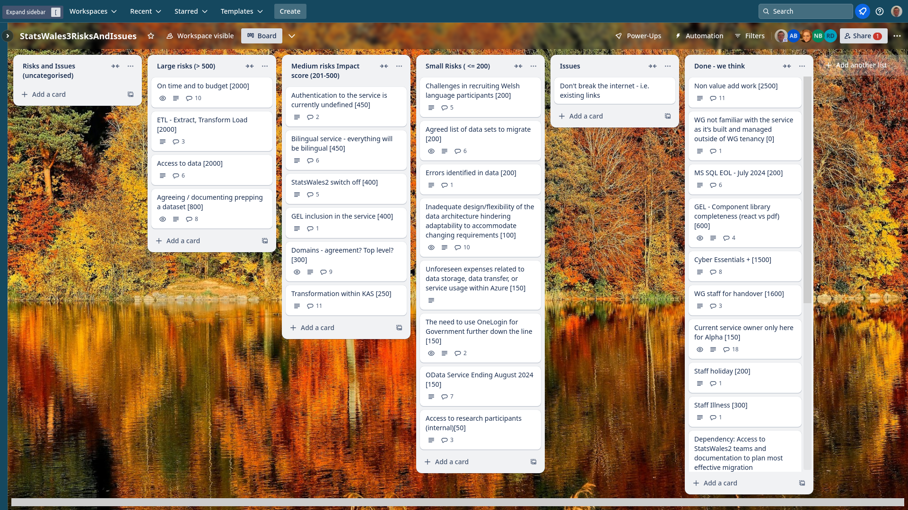

Weekly report
=============

The letter n
------------------------------

What we did last week
------------------------

- Plan and conduct tree test of topics taxonomy (publishers and data consumers)
- Data audit for data migration 

What we're planning to do this week
-----------------------------------

- Prototype update journey
- Discussion - what needs to happen next to progress data migration?
- Planning next round of research with publishers.
- Stand up the service in WG Azure
- Happy path user flow for updating a dataset
- [SPIKE] Data access strategy
- Implement domain model on back-end
- Data domain model

-----------------------------------

These are the goals that we set for this sprint:

- Complete “publish a dataset” up to metadata
  _**In progress**_

- Get full download of most recent OData
  _**In progress**_

- Azure pipeline in WG estate
  _**In progress**_

Things to bear in mind / What's blocking us
-------------------------------------------

The following things are still blocking the progress of the project

- Access to the source data
  ***Progress is being made on understanding which data needs to be migrated and which data can be recreated in the new system***

- Azure pipeline
  ***Work is continuing to build the development pipeline***

Screen shot of risks and issues board
-------------------------------------

