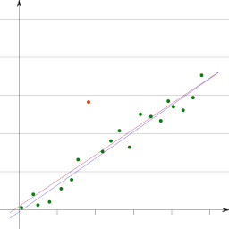
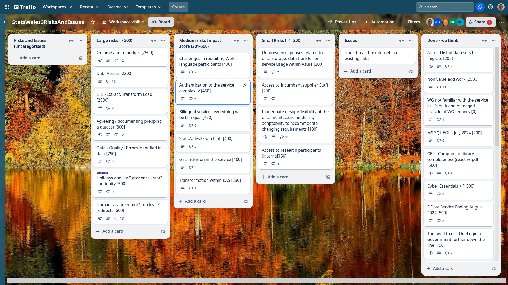
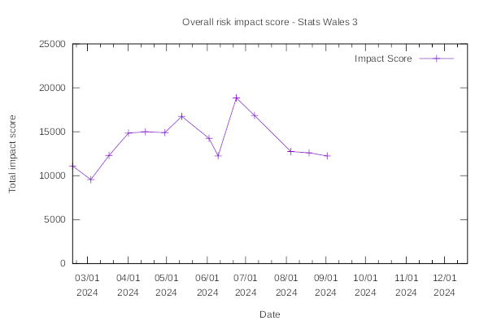

Weekly report
=============

Outlier
------------------------------

What we did last week
------------------------

- Report on OData
- Conduct and analyse tree test of topics taxonomy (with publishers)

What we're planning to do this week
-----------------------------------

- OData loader
- Conduct and analyse tree test of topics taxonomy (with publishers)
- KAS Analysis of data migration exercise (questionnaire)
- Prototype update journey
- Discussion - what needs to happen next to progress data migration?
- Planning next round of research with publishers.
- Stand up the service in WG Azure
- Happy path user flow for updating a dataset
- [SPIKE] Data access strategy
- Implement domain model on back-end
- Data domain model

Sprint goals
-----------------------------------

These are the goals that we set for this sprint:

- Complete "publish a dataset" up to metadata (development)
  _**In progress**_

- Azure pipeline in WG estate (dev ops) 
  _**In progress**_

-  Get full download of most recent OData (data)
  _**In progress**_

Things to bear in mind / What's blocking us
-------------------------------------------

The following things are still blocking the progress of the project

- Access to the source data
  ***We are waiting for access to a server which we think might help with data access and migration***
- Azure subscriptions
  ***We have requested further permissions which are required to build the pipeline from the Marvell estate to the WG estate***

Screen shot of risks and issues board
-------------------------------------

Risk impact chart
-------------------------------------

