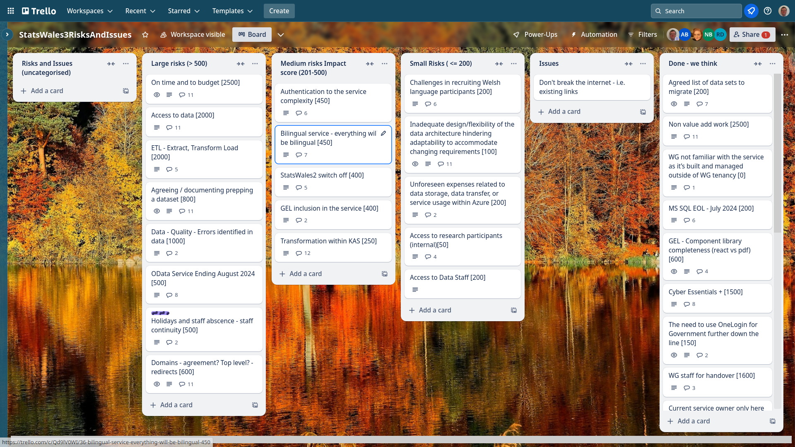

Weekly report
=============

Outlier
------------------------------

What we did last week
------------------------

- OData loader
- KAS Analysis of data migration exercise (questionnaire)
- Prototype update journey
- Planning next round of research with publishers.
- Make publishers aware when a cube is first created - approach!
- Implement hierarchies - alongside geography table
- Happy path user flow for updating a dataset

What we're planning to do this week
-----------------------------------

- [SPIKE] OneLogin prototype
- Report on OData
- Move backend over to using Node Streaming API
- Conduct and analyse tree test of topics taxonomy (with publishers)
- Discussion - what needs to happen next to progress data migration?
- Stand up the service in WG Azure
- [SPIKE] Data access strategy
- Implement domain model on back-end
- Data domain model

-----------------------------------

These are the goals that we set for this sprint:

- Complete “publish a dataset” up to metadata
  _**In progress**_

- Understand which data will be migrated into the new service and how 
  _**In progress**_

- Azure pipeline in WG estate
  _**In progress**_

Things to bear in mind / What's blocking us
-------------------------------------------

The following things are still blocking the progress of the project

- Access to the source data
  ***We are still looking at the data file***

- Azure pipeline
  ***We do not yet have a full pipeline from Marvell Azure to Welsh Government Azure***

Screen shot of risks and issues board
-------------------------------------

