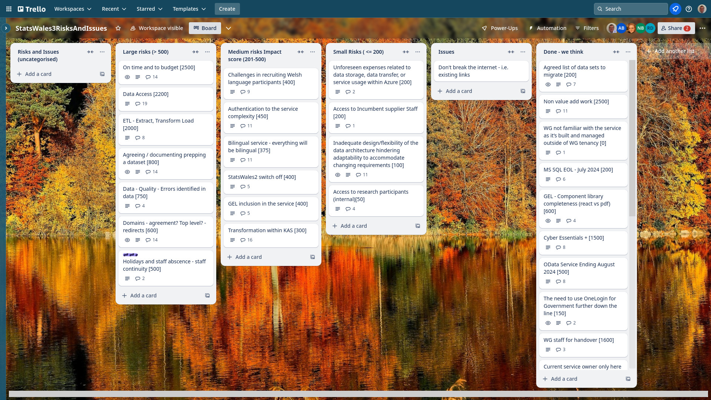
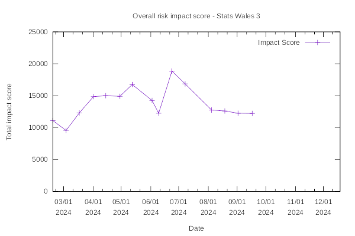

Weekly report
=============

p-value
------------------------------

What we did last week
------------------------

- First data prototype for publisher update journey research
- "Consumer experience workshops: Challenges
- Provide sample data from SW2 data cube to help with SW3 format 
- [SPIKE] Data access strategy

What we're planning to do this week
-----------------------------------

- Get reference data into postgres database
- Test the proposed taxonomy with consumers
- Test the update journey designs
- Test the guidance for publishers
- Run the consumer taxonomy study
- Plan the next round of consumer research
- Discussion - what needs to happen next to progress data migration?
- Data table: Column labelling
- Stand up the service in WG Azure

-----------------------------------

These are the goals that we set for this sprint:

- Complete “publish a dataset” up to metadata (development) In progress
_**In progress**_

- Azure pipeline in WG estate (dev ops)
_**In progress**_

Things to bear in mind / What's blocking us
-------------------------------------------

The following things are still blocking the progress of the project

- Access to the source data
  ***There is a danger that the data that we need to access may not be available all the time*** 

- Azure pipeline
  ***We do not yet have a full pipeline from Marvell Azure to Welsh Government Azure***

Screen shot of risks and issues board
-------------------------------------

