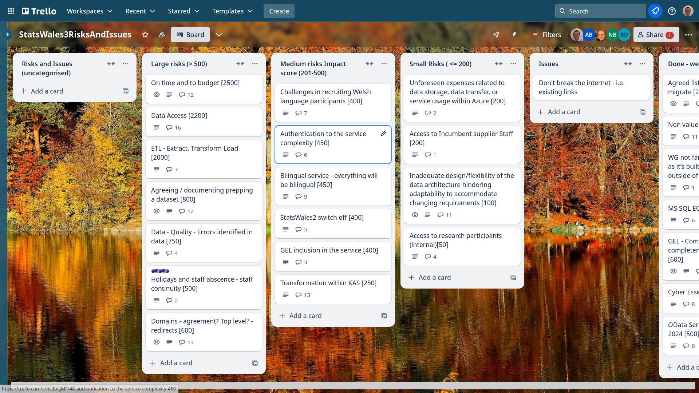

Weekly report
=============

p-value
------------------------------

What we did last week
------------------------

- Start to think about publishing approval process - MVP
- Follow up on feedback so far from taxonomy study

What we're planning to do this week
-----------------------------------

- Mocked data prototypes for publisher update journey research
- "Consumer experience workshops: Challenges
- Run the consumer taxonomy study
- Plan the next round of consumer research
- [SPIKE] OneLogin prototype
- Provide sample data from SW2 data cube to help with SW3 format
- Move backend over to using Node Streaming API
- Discussion - what needs to happen next to progress data migration?
- Data table: Column labelling
- Stand up the service in WG Azure
- [SPIKE] Data access strategy

-----------------------------------

These are the goals that we set for this sprint:

- Complete “publish a dataset” up to metadata (development) In progress
_**In progress**_

- Azure pipeline in WG estate (dev ops)
_**In progress**_

Things to bear in mind / What's blocking us
-------------------------------------------

The following things are still blocking the progress of the project

- Access to the source data
  ***We think we have the access we need***

- Azure pipeline
  ***We do not yet have a full pipeline from Marvell Azure to Welsh Government Azure***

Screen shot of risks and issues board
-------------------------------------

