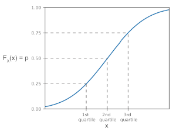
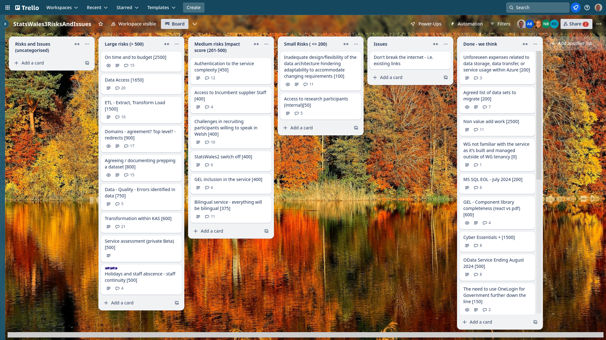
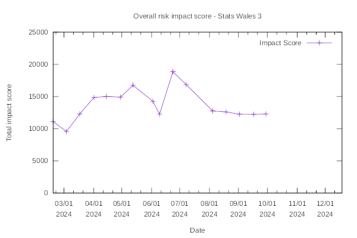

Weekly report
=============

Quartile
------------------------------

What we did last week
------------------------

- Send the guidance to SME
- Design exploration - upload your own lookup table
- Prepare update data table prototype
- Test the guidance for publishers
- [BUG] Publish a dataset flow gets stuck in a loop.
- Run the consumer taxonomy study
- Follow up on feedback so far from taxonomy study
- Consume the domain model on the front end
- Data table: Column labelling
- Update content on 'Create a new dataset' to reflect current approach
- Replacing 'Name the dataset' with 'What is the title of the dataset'
- Implement domain model on back-end
- Implement Task List Create a dataset
- Implement Successful upload confirmation (data table preview)

What we're planning to do this week
-----------------------------------

- Dimension: Load reference data 
- Prototype iterations to update data table journey
- Stand up all bits of infrastructure from scratch in Terraform
- SW3 OKRs and metrics 
- Remove lang from URL path in the backend and use header
- Extract data for testing updates
- Get reference data into postgres database
- Test the proposed taxonomy with consumers
- Test the update journey designs
- MVP consumer site prototype
- Plan the next round of consumer research
- Identify candidate area that could be prototyped and conducted in Welsh.
- Stand up the service in WG Azure

These are the goals that we set for this sprint
-----------------------------------------------

- Create journey up to upload data table - saying what the data table contains (SME to upload flying start csv data)  
_**In progress**_

Screen shot of risks and issues board
-------------------------------------

