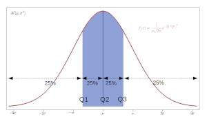
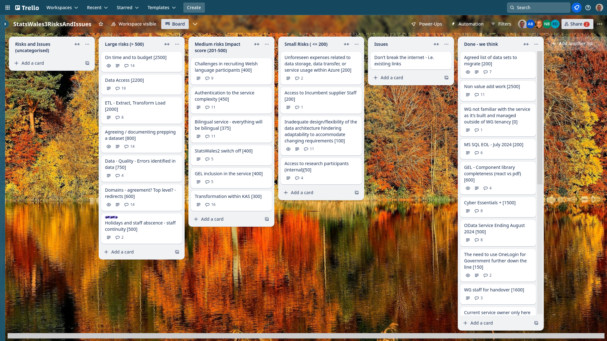

Weekly report
=============

Quartile
------------------------------

What we did last week
------------------------

- Prepare prototype with real data for testing 
- Test the guidance for publishers
- "Enable a working environment
- Run the consumer taxonomy study
- [SPIKE] OneLogin prototype
- Discussion - what needs to happen next to progress data migration?
- Stand up a blob storage and a redis instance

What we're planning to do this week
-----------------------------------

- Design exploration - upload your own lookup table
- Extract tran0140 for testing updates
- Get reference data into postgres database
- Test the proposed taxonomy with consumers
- Test the update journey designs
- MVP consumer site prototype
- Plan the next round of consumer research
- Identify candidate area that could be prototyped and conducted in Welsh.
- Data table: Column labelling
- Stand up the service in WG Azure
- Implement Task List Create a dataset

-----------------------------------

These are the goals that we set for this sprint:

- Create journey up to upload data table - saying what the data table contains (SME to upload flying start csv data) 
_**In progress**_

Screen shot of risks and issues board
-------------------------------------

