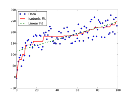
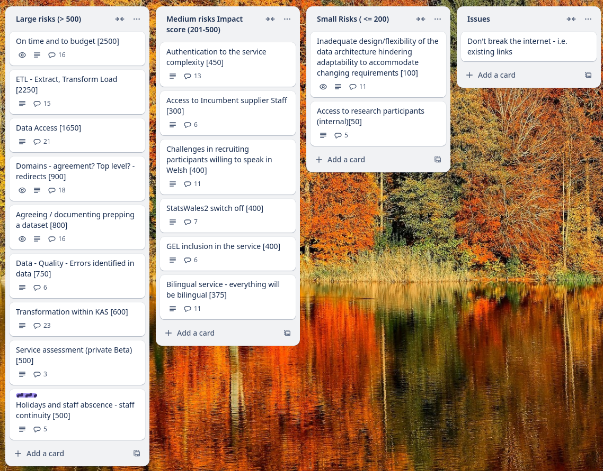
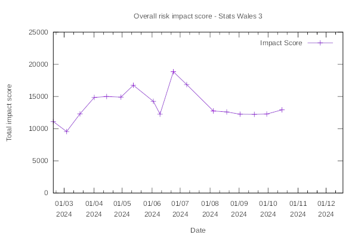

Weekly report
=============

Regression
------------------------------

What we did last week
------------------------

- Flag failing builds - roll back when build fails
- Explore how much reference data changes and how much measurement codes change 
- Force the user to re-auth if the backend returns 401
- Stand up all bits of infrastructure from scratch in Terraform for Marvell
- Design proposal - data view
- Remove lang from URL path in the backend and use header
- [BUG] Site goes back to English when homepage is selected.
- [BUG] Website goes back to English when Welsh has been selected.
- [BUG] Language button doen't work and then inverts itself.

What we're planning to do this week
-----------------------------------

- Create stimulus/prototype for consumer testing - view data
- Book sessions with data consumers
- Gather information around Roles Based Access Control 
- Ability to edit the data table section after it has been completed
- Start creating a roadmap for publisher adoption of SW3
- Translate any new content added in Sprint 16
- Define SW3 OKRs and metrics 
- Dimension: Dates reference data branch
- Test the proposed taxonomy with consumers
- Data architecture internals - online cube model
- Plan research with consumers
- Dimensions: Choose common reference data
- Stand up the service in WG Azure

These are the goals that we set for this sprint
-----------------------------------------------

- Language switching working as expected (development) 
  _**In progress**_

- Front end for time reference data (development) 
  _**In progress**_

- First design for consumer-side table view (design)
  _**In progress**_

Screen shot of risks and issues board
-------------------------------------

Risk impact score chart
-----------------------

