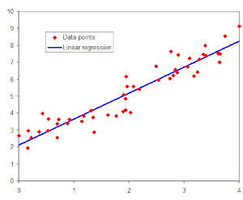
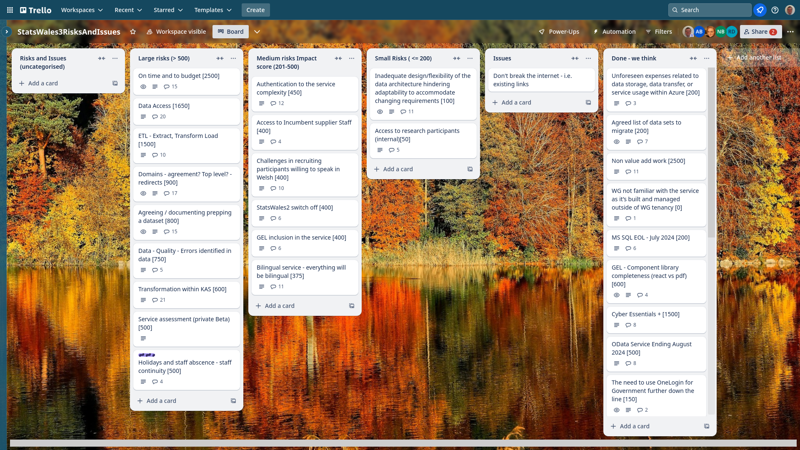

Weekly report
=============

Regression
------------------------------

What we did last week
------------------------

- Prototype iterations to update data table journey
- Internal show and tell - demo to the team
- Extract data for testing updates
- Get reference data into postgres database
- Test the update journey designs
- MVP consumer site prototype
- [BUG] Login doesn't protect anything 
- [BUG] List data files shows blank screen or error.
- Start interaction with data preparation team - First artefact
- Identify candidate area that could be prototyped and conducted in Welsh.

What we're planning to do this week
-----------------------------------

- Ability to edit the data table section after it has been completed
- Decide approach for 3 metadata fields currently not in design
- Dimension: Load reference data 
- Stand up all bits of infrastructure from scratch in Terraform for Marvell
- Design proposal - data view
- Define SW3 OKRs and metrics 
- Test the proposed taxonomy with consumers
- [BUG] Welsh Error code is in English
- [BUG] Site goes back to English when homepage is selected.
- [BUG] Website goes back to English when Welsh has been selected.
- Data architecture internals - online cube model
- Plan the next round of consumer research
- Stand up the service in WG Azure

Goals
-----------------------------------

These are the goals that we set for this sprint:

- Language switching working as expected (development) 
_**In progress**_

- Front end for time reference data (development) 
_**In progress**_

- First design for consumer-side table view (design)
_**In progress**_

Screen shot of risks and issues board
-------------------------------------

