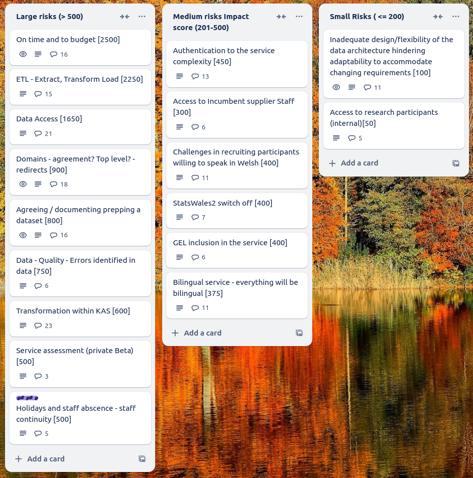

Weekly report
=============

Standard Deviation
------------------------------

What we did last week
------------------------

- Test the find and view designs with consumers
- Create stimulus/prototype for consumer testing - view data
- Test the proposed taxonomy with consumers

What we're planning to do this week
-----------------------------------

- Identify more users with access needs
- Exploration of totals and averages
- Test matching to reference data using SW2 datasets
- Deploy front-end and back-end applications into automated infrastructure
- Create the SW3 service map - first draft
- Gather information around Roles Based Access Control
- Ability to edit the data table section after it has been completed
- Start creating a roadmap for publisher adoption of SW3
- Start to understand cube migration
- Dimension: Dates reference data branch
- Data architecture internals - online cube model
- Dimensions: Choose common reference data
- Stand up the service in WG Azure

These are the goals that we set for this sprint
-----------------------------------------------

Ready to test time series dimension with SME 
_**In progress**_

Conduct research sessions with consumers to test v1 of find and view
_**Done**_

Progress our understanding of the cube model
_**In progress**_

Screen shot of risks and issues board
-------------------------------------

