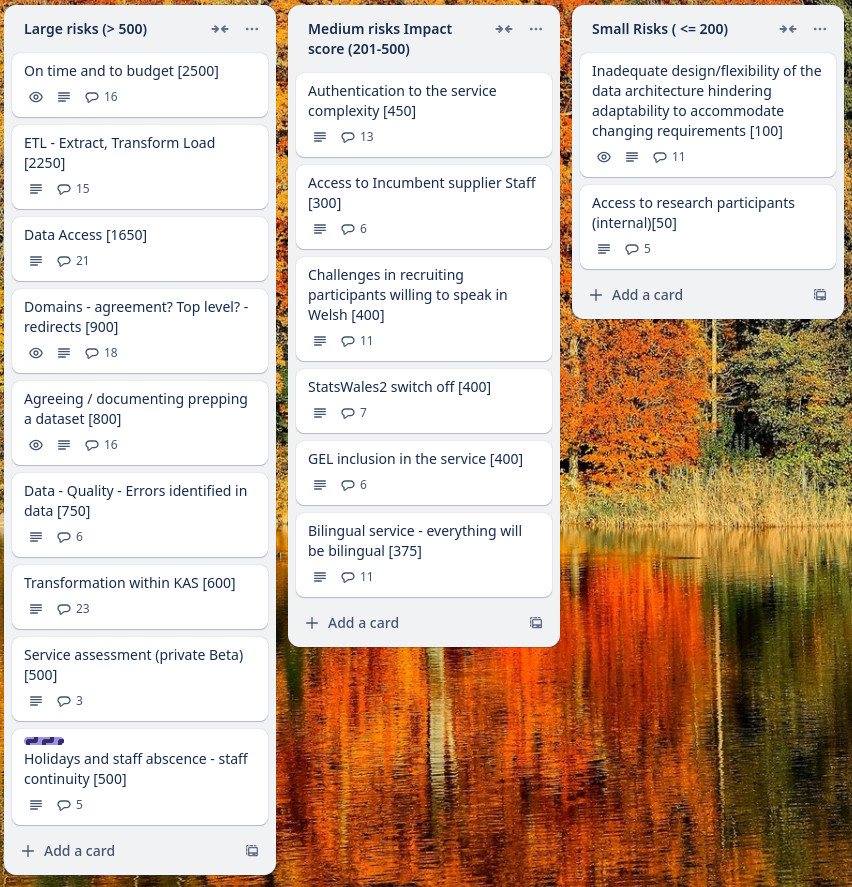

Weekly report
=============

Standard Deviation
------------------------------

What we did last week
------------------------

- Summarise findings from testing the 'update a dataset' prototype
- Explore how much reference data changes and how much measurement codes change 
- Force the user to re-auth if the backend returns 401
- Translate any new content added in Sprint 16
- Define SW3 OKRs and metrics - first iteration
- Test the proposed taxonomy with consumers
- [BUG] Welsh Error code is in English
- [BUG] Menu links are generated incorrectly and URL routing matches over broadly.
- Plan research with consumers

What we're planning to do this week
-----------------------------------

- Exploration of totals and averages 
- Test matching to reference data using SW2 datasets
- Create stimulus/prototype for consumer testing - view data
- Deploy front-end and back-end applications into automated infrastructure
- Create the SW3 service map - first draft
- Gather information around Roles Based Access Control 
- Ability to edit the data table section after it has been completed
- Start creating a roadmap for publisher adoption of SW3
- Start to understand cube migration
- Dimension: Dates reference data branch
- Data architecture internals - online cube model
- Dimensions: Choose common reference data
- Stand up the service in WG Azure

Goals
-----------------------------------

These are the goals that we set for this sprint:

Ready to test time series dimension with subject matter expert 
_**In progress**_

Conduct research sessions with consumers to test v1 of find and view
_**In progress**_

Progress our understanding of the cube model
_**In progress**_

Screen shot of risks and issues board
-------------------------------------

