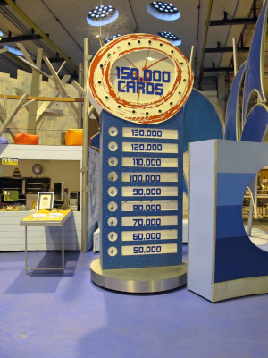
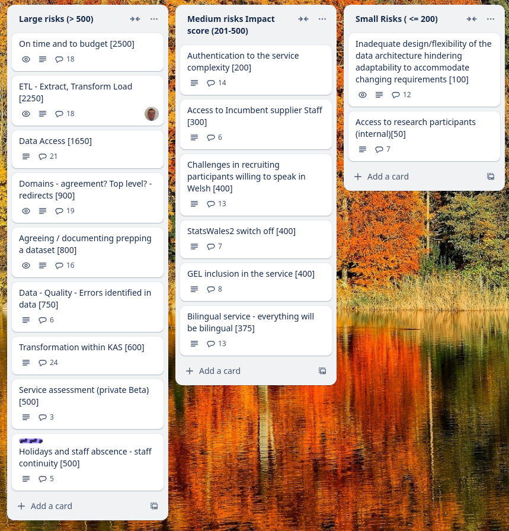
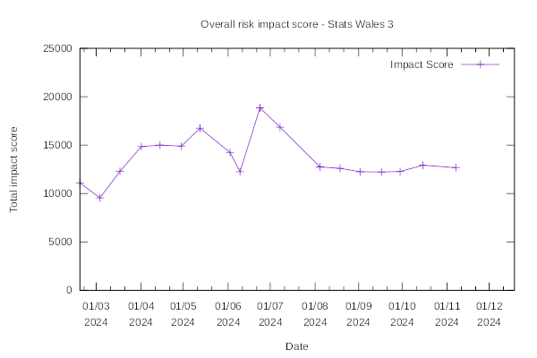
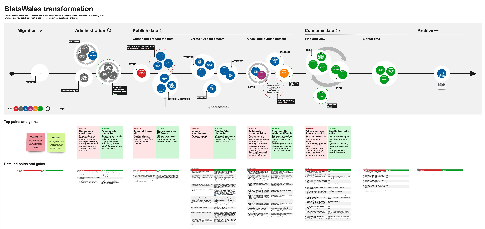

Weekly report
=============

"Total"
------------------------------

What we did last week
------------------------

- Gather stakeholder feedback and iterate the data model solution document
- Iterate consumer view stimulus for third sector research
- Support for decision around ISO format for time
- Prepare Data Model Solution Design deliverable for submission to the data working group
- Plan engagement with the Third Sector User Panel on 7 Nov
- Create the SW3 map to demonstrate outcomes - first draft
- Missing error message "failed_to_get_preview"
- Explore new OData service

What we're planning to do this week
-----------------------------------

- Design and agree administration of reference data for MVP+
- Summarise findings and next steps from taxonomy research study
- Identify more users with access needs
- Exploration of totals and averages
- Deploy front-end and back-end applications into automated infrastructure
- Explore access permissions requirements
- Data architecture internals - online cube model
- Dimensions: Choose common reference data
- Metadata: Sources added
- Metadata: Add a data source from the selected data provider
- Metadata: Add a data provider
- Stand up the service in WG Azure

These are the goals that we set for this sprint
-----------------------------------------------

- Agree data document for project board _**Done**_ 
- Do follow-up research with consumers at third-sector event. _**Done**_
- Metadata in working software (topics, stretch goal) _**In progress**_

Screen shot of risks and issues board
-------------------------------------

Chart showing change in risk profile
------------------------------------

Transformation map showing changes that will be made to the service in Stats Wales 3
-----------------------------------------------------------------------------

The map shows the holistic end-to-end transformation of StatsWales. It highlights painpoints evidenced in the current service and proposed outcomes as a result of processes that will be removed, added or changed.

