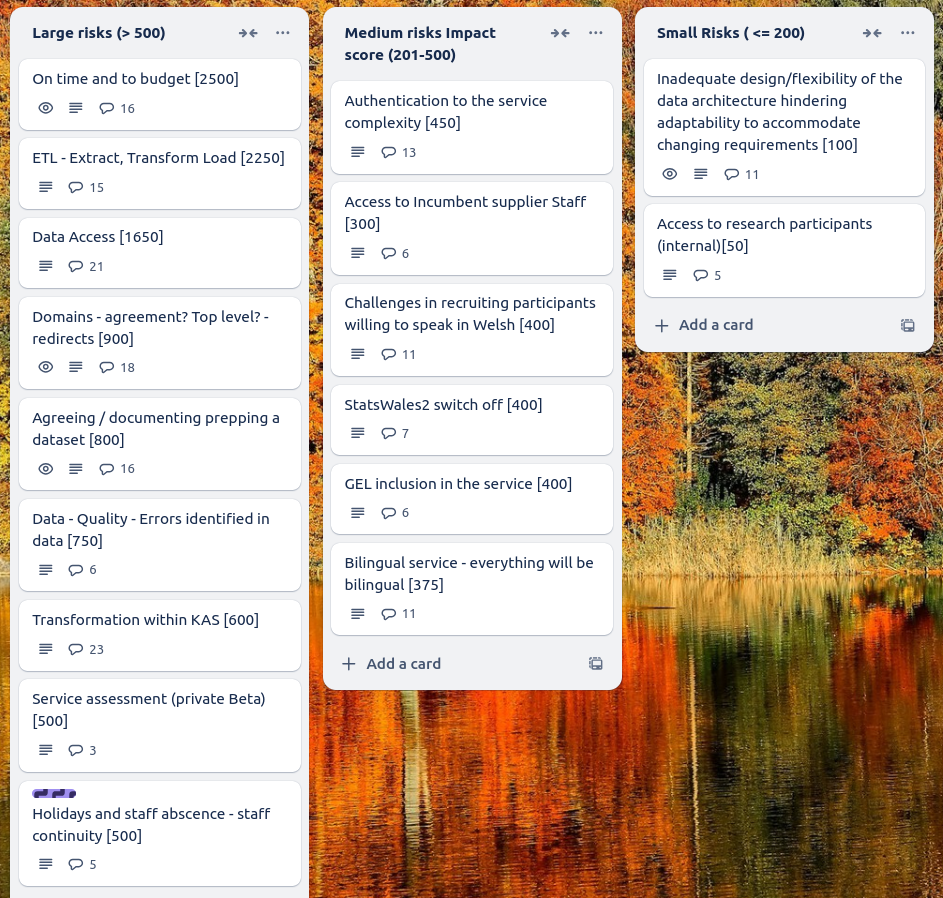

Weekly report
=============

Total
------------------------------

What we did last week
------------------------

- Test the "find and view" designs with consumers
- Test matching to reference data using SW2 datasets
- Add placeholder text for missing column headers
- Start creating a roadmap for publisher adoption of SW3
- Start to understand cube migration and publisher onboarding

What we're planning to do this week
-----------------------------------

- Iterate consumer view stimulus for third sector research
- Summarise findings and next steps from taxonomy research study
- Prepare Data Model Solution Design deliverable for submission to the project board
- Identify more users with access needs
- Exploration of totals and averages
- Plan engagement with the Third Sector User Panel on 7 Nov
- Deploy front-end and back-end applications into automated infrastructure
- Explore access permissions requirements
- Data architecture internals - online cube model
- Dimensions: Choose common reference data
- Stand up the service in WG Azure

Goals
-----------------------------------

These are the goals that we set for this sprint:

- Agree data document for project board _**In progress**_
- Do follow-up research with consumers at third-sector event _**In progress**_

Screen shot of risks and issues board
-------------------------------------

