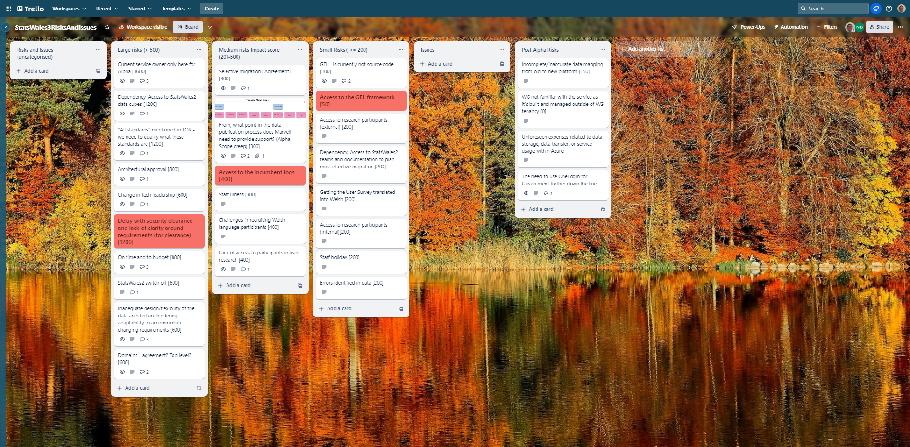
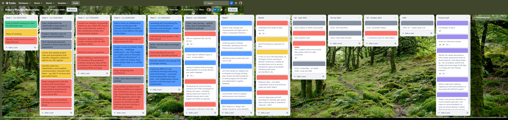

## What we did last week
- Disseminate the survey to the data publishers.
- Implement the data consumer bilingual survey using Smart Survey
- Plan session to look at current product analytics
- Terms of References
- Define concepts for prototype testing

## What we're planning to do this week
- Agree approach for displaying data for Alpha
- Conduct remote usability testing data processors / publishers
- Implement privacy notice statement in HTML on the SW site
- Automate infrastructure as code for publishing app
- Look at the data quality ticket in the delivery board - split into tickets and identify first step
- Plan testing of the alpha prototype
- Develop prototypes
- Recruit participants for testing the alpha prototype
- Access for full data cubes for Statswales2
- Publish data consumer survey to the SW site
- Analyse survey data from data processors

## Goals

These are our goals for this sprint

- Create metadata database and link to assets in datalake _**In progress**_
- Design and test prototypes with data processors/publishers _**In progress**_
- Data: start to structure/analyse data in Azure once there is some in there _**In progress**_
- Upload data to a data lake (includes Demo) _**Done**_

## Things to bear in mind
- Two members of our team have now managed to transfer their SC clearance

## Screen shot of risks and issues board

## Chart showing risk impact

## Screenshot of delivery plan

