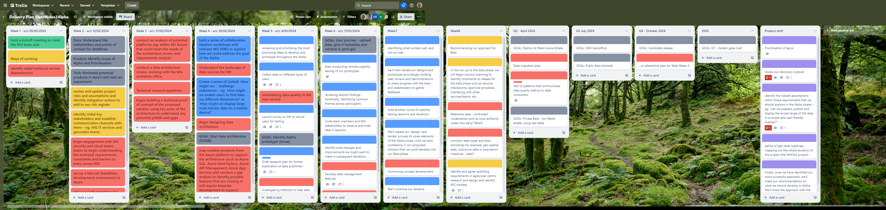

## What we did last week
-  Create a plan for prototype testing
-  Pilot data processor feedback survey with two participants
-  IaC a data lake
-  Points / Milestones against which project will be tracked / paid
-  Mapping data on the current service
-  Examination of lookup tables and identification of those that overlap
-  Design exploration - what first after user story review?
-  Get data consumer survey translated into Welsh
-  Build backlog of user stories in Azure
-  Walk through of the Stats Wales Back office

## What we’re planning to do this week
- Plan testing of our prototype with users
- Automate infrastructure as code for publishing app
- Terms of References
- Disseminate the survey to the data publishers
- Agree approach for displaying data for Alpha
- Analyse survey data from data processors
- Develop prototypes
- Access for full data cubes for Statswales2
- Define concepts for prototype testing
- Recruit participants for testing the alpha prototype
- Session to look at current product analytics
- Look at the data quality ticket in the delivery board - split into tickets and identify first step

## Goals

These are our goals for this sprint
- Create metadata database and link to assets in datalake _**In progress**_
- Data: start to structure/analyse data in Azure once there is some in there _**In progress**_
- Design and test prototypes with data consumers _**In progress**_
- Upload data to a data lake (includes Demo) _**In progress**_
- Agree the scope for Alpha _**Done**_
- Document high-level architecture and Azure products _**Done**_

## Things to bear in mind
- Transfer of SC clearance is *still* currently a limiting factor on progress

## Screen shot of risks and issues board

## Screenshot of delivery plan

