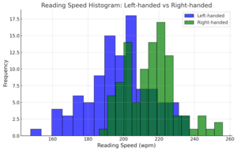
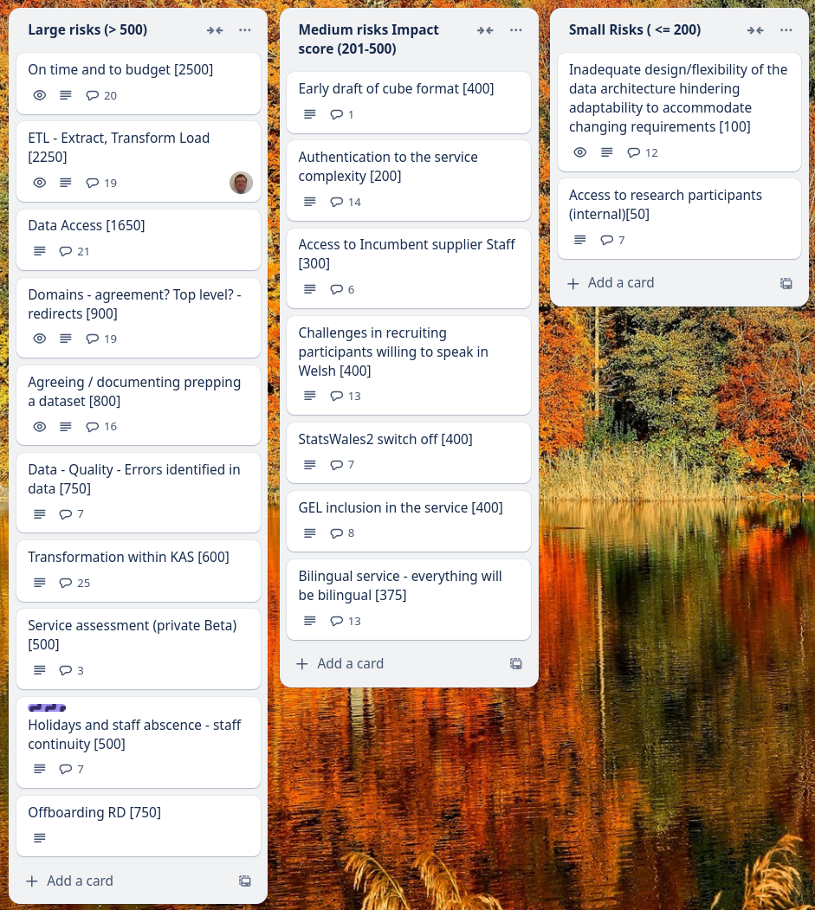
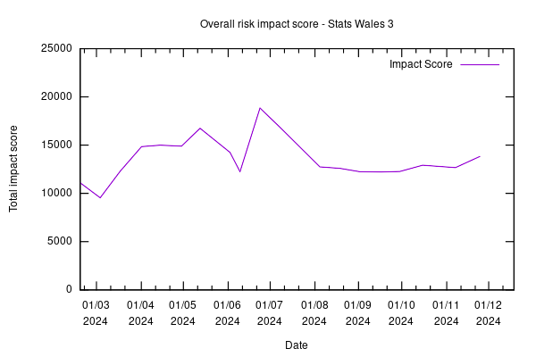

Weekly report
=============

U-Statistic
------------------------------

What we did last week
------------------------

- Iterate consumer dataset view prototype for GSS event
- Design and agree administration of reference data for MVP and beyond

What we're planning to do this week
-----------------------------------

- Metadata: Add a data source from the selected data provider lacks validation
- Configure a suitable testing suite for e2e tests
- Organise follow up research sessions with publishers from taxonomy research
- Identify more users with access needs
- Deploy front-end and back-end applications into automated infrastructure
- Explore access permissions requirements
- Content and error message updates to initial create journey screens
- Dimension: Dates reference data branch
- Data architecture internals - online cube model
- Dimensions: Choose common reference data
- Stand up the service in WG Azure

These are the goals that we set for this sprint
-----------------------------------------------

- Understand the scope for remaining items on the roadmap for MVP. _**In progress**_
- Identify and document a steel thread for create journey working software _**In progress**_
- End to end test environment _**In progress**_
- Deploy to WG infrastructure _**In progress**_

Screen shot of risks and issues board
-------------------------------------

Chart showing change in risk profile
------------------------------------

