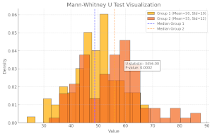

Weekly report
=============

U-Statistic
------------------------------

What we did last week
------------------------

- Summarise findings and next steps from taxonomy research study
- Prepare Data Model Solution Design deliverable for submission to the data working group
- Prep for project board 11:30  Monday 11th November
- Create the SW3 map to demonstrate outcomes - first draft
- Ability to edit the data table section after it has been completed
- Links to data table task duplicated
- Create a dataset: Error message 
- Metadata: How is this dataset designated?
- Metadata: Will this dataset be regularly updated?
- Metadata: Report links added
- Metadata: Add a link to a report
- Metadata: What is the statistical quality of this dataset?
- Metadata: How was the data collected or calculated?
- Metadata: What is the summary of the dataset?
- Metadata: What is the title of the dataset?

What we're planning to do this week
-----------------------------------

- Organise follow up research sessions with publishers from taxonomy research
- Identify more users with access needs
- Deploy front-end and back-end applications into automated infrastructure
- Explore access permissions requirements
- Dimension: Dates reference data branch
- Data architecture internals - online cube model
- Dimensions: Choose common reference data
- Stand up the service in WG Azure

Goals
-----------------------------------

These are the goals that we set for this sprint:
- Understand the scope for remaining items on the roadmap for MVP. _**In progress**_
- Identify and document a steel thread for create journey working software _**In progress**_
- End to end test environment _**In progress**_
- Deploy to WG infrastructure. (U-statistic) _**In progress**_

Risk and Issues
-------------------------------
Current table showing project Risks and Issues

Video of the most recent show and tell
--------------------------------------
[Show and Tell 14_11_2024](https://drive.google.com/file/d/18JU6gKGDaFBkK2l1rCvwjJV0aodEnEIU/view?usp=sharing)

Current version of the service transformation map
-------------------------------------------------
[Transformation map](transformationMap.pdf)
