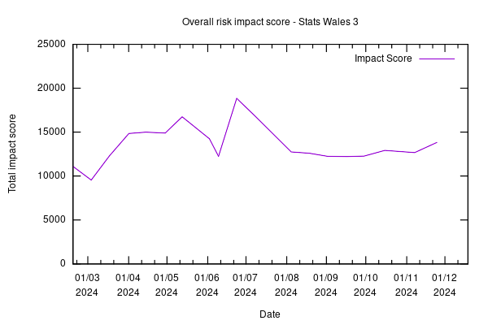

Weekly report
=============

venn
------------------------------

What we did last week
------------------------

- Send invites to taxonomy follow up research with publishers

What we're planning to do this week
-----------------------------------

- Explore the design of views with larger / more complex datasets
- Onboard MVP collaborators
- Iterate beta product roadmap beyond  mvp build
- Handover from Register Dynamics
- Metadata: Publisher organisation and contact
- Configure a suitable testing suite for e2e tests
- Prepare to test the next iteration of working software (ref data and metadata) with SME publisher
- Hold workshop to discuss data migration
- Deploy front-end and back-end applications into automated infrastructure
- Time source
- Content and error message updates to initial create journey screens
- Dimension: Dates reference data branch
- Dimensions: Choose common reference data
- Stand up the service in WG Azure

These are the goals that we set for this sprint
-----------------------------------------------

- Understand the scope for remaining items on the roadmap for MVP. _**In progress**_
- Identify and document a steel thread for create journey working software _**In progress**_
- End to end test environment _**In progress**_
- Deploy to WG infrastructure _**In progress**_

Screen shot of risks and issues board
-------------------------------------

Chart showing change in risk profile
------------------------------------

