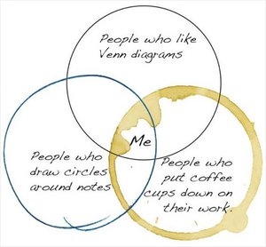
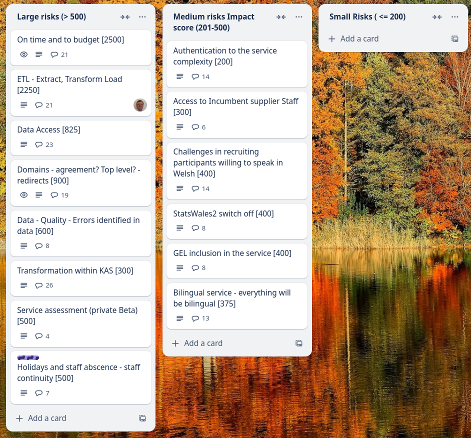
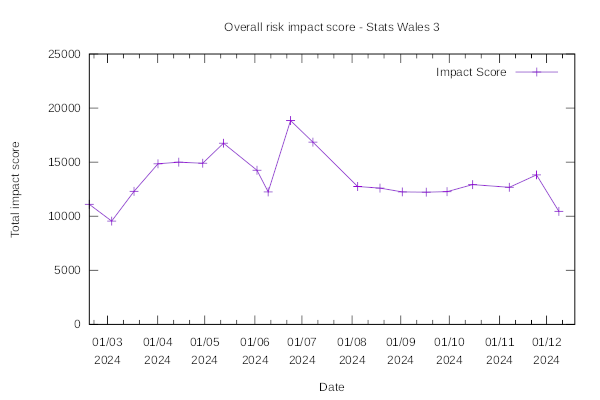
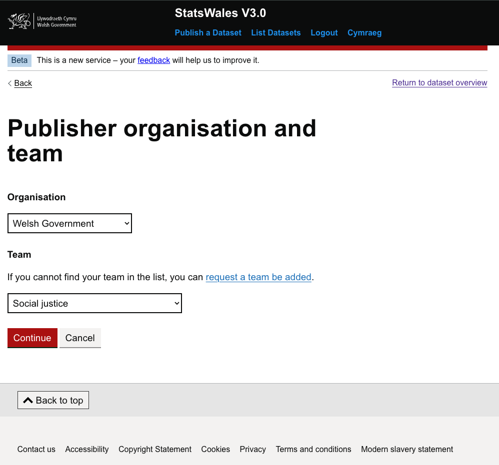
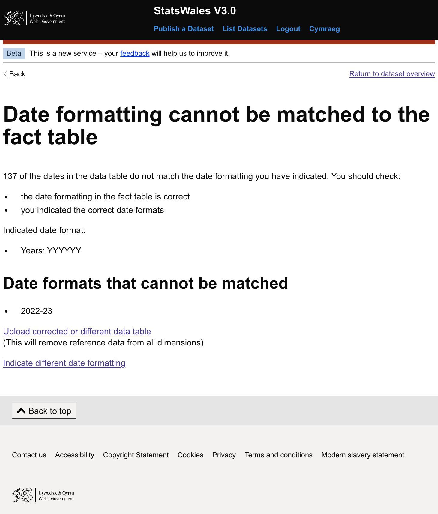
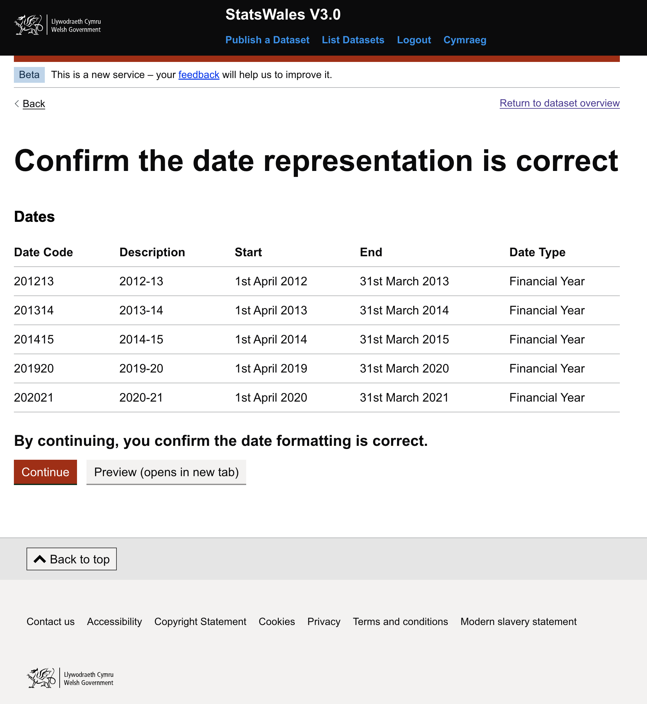

Weekly report
=============

Venn diagram
------------------------------

What we did last week
------------------------

- Iterate beta product roadmap beyond  mvp build
- Metadata: Add a data source from the selected data provider lacks validation
- Metadata: Publisher organisation and contact
- Metadata: Topics
- Suggested changes from metadata design review
- Time format - understand our approach [Decision]
- Provide a way for the user to log out from the frontend
- Metadata: Sources added
- Metadata: Add a data source from the selected data provider
- Metadata: Add a data provider

What we're planning to do this week
-----------------------------------

- Explore the design of views with larger / more complex datasets
- Onboard MVP collaborators
- Handover from Register Dynamics 
- Prepare to test the next iteration of working software (ref data and metadata) with SME publisher 
- Hold workshop to plan data migration exercise
- Deploy front-end and back-end applications into automated infrastructure
- Dimension: Implement time source 
- Dimension: Dates reference data branch
- Publishing: Translation export and import
- Dimensions: Choose common reference data
- Stand up the service in WG Azure

These are the goals that we set for this sprint
-----------------------------------------------

- Understand the scope for remaining items on the roadmap for MVP _**Done**_
- Identify and document a steel thread for create journey working software _**Done**_
- End to end test environment _**In progress**_
- Deploy to WG infrastructure _**In progress**_

Screen shot of risks and issues board
-------------------------------------

Chart showing change in risk profile
------------------------------------

Screenshots from working software
-------------------------------------------------

