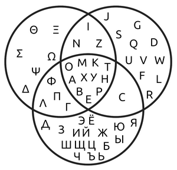

Weekly report
=============

Venn Diagram
------------------------------

What we did last week
------------------------

- \[Bug\] `Trying to create dataset with a certain CSV causes unspecific error message
- Iterate consumer dataset view prototype for GSS event
- Understand the scope for remaining items on the roadmap for MVP (break down into further tickets as necessary)
- Prep for GSS dissemination committee
- Hold internal data measures workshop
- Organise follow up research sessions with publishers from taxonomy research
- Identify more users with access needs
- Book sessions with data consumers
- Explore access permissions requirements
- Redis is open to entire Internet
- Approach for mapping legacy footnotes in SW3

What we're planning to do this week
-----------------------------------

- Explore the design of views with larger / more complex datasets
- Onboard MVP collaborators
- Send invites to taxonomy follow up research with publishers
- Iterate beta product roadmap beyond  mvp build
- Configure a suitable testing suite for e2e tests
- Time format - understand our approach [Decision]
- Deploy front-end and back-end applications into automated infrastructure
- Time source
- Content and error message updates to initial create journey screens
- Dimension: Dates reference data branch
- Data architecture internals - online cube model
- Publishing: When should this dataset be published?
- Dimensions: Choose common reference data
- Stand up the service in WG Azure

Goals
-----------------------------------

These are the goals that we set for this sprint:
- End to end automated testing _**In progress**_
- Deploy to WG infrastructure _**In progress**_
- Test create journey with Nicole _**In progress**_
- Explore data views with larger datasets - predefined views (Venn Diagram) _**In progress**_

Risk and Issues
-------------------------------
Current table showing project Risks and Issues

Video of the most recent show and tell
--------------------------------------
[Show and Tell 14_11_2024](https://drive.google.com/file/d/18JU6gKGDaFBkK2l1rCvwjJV0aodEnEIU/view?usp=sharing)

Screenshots from candiate design prototypes
-------------------------------------------------
[Transformation map](transformationMap.pdf)

Screenshots from working software
-------------------------------------------------
