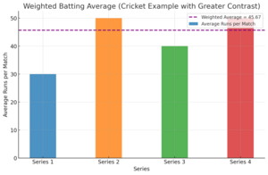
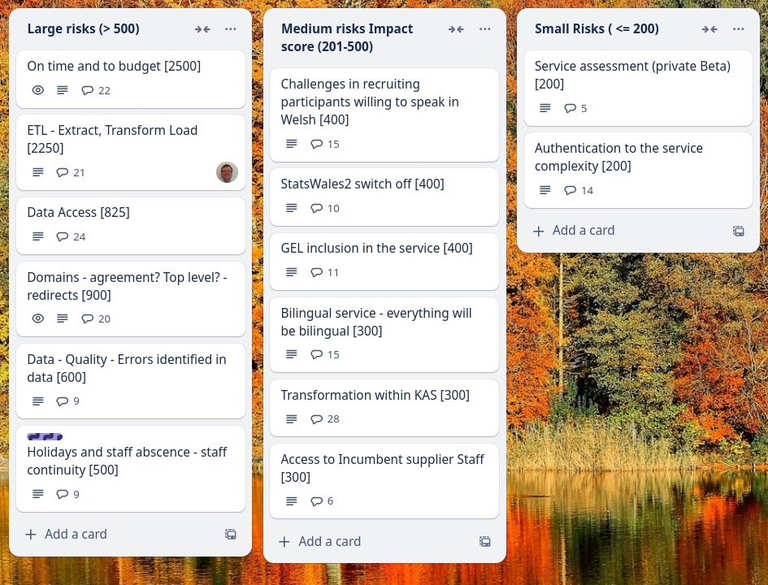
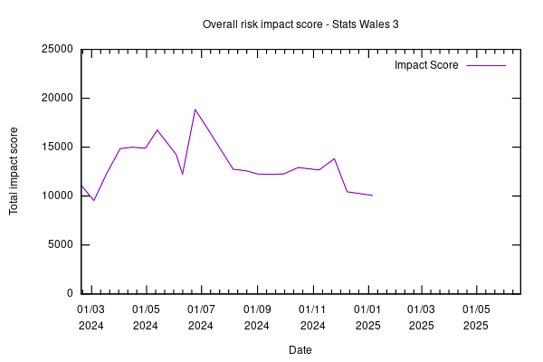

Weekly report
=============

Weighted Average
------------------------------

What we did last week
------------------------

- Explore the design of views with larger / more complex datasets
- View guidance (design)
- Publishing: When should this dataset be published? 
- GEL fixes from review Oct 2024
- Review & iterate user needs board
- Publisher research - dataset design and consumer experience workshop 1
- Onboard MVP collaborators

What we're planning to do this week
-----------------------------------

- Prototype HLTH and WIMD datasets for consumer testing
- Handover from Register Dynamics
- Dimension: Name
- Configure a suitable testing suite for e2e tests
- Prepare to test the next iteration of working software (ref data and metadata) with SME publisher
- Deploy front-end and back-end applications into automated infrastructure
- Provide CSV data for time dimension testing
- Content and error message updates to create journey screens
- Dimensions: Choose common reference data
- Stand up the service in WG Azure

These are the goals that we set for this sprint
-----------------------------------------------

- End to end automated testing  _**In progress**_
- Deploy to WG infrastructure  _**In progress**_
- Test the create journey _**In progress**_
- Prepare for next round of consumer testing on views  _**In progress**_
- Feasibility analysis - OData to structural model  _**In progress**_

Screen shot of risks and issues board
-------------------------------------

Chart showing change in risk profile
------------------------------------

