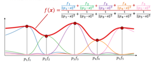
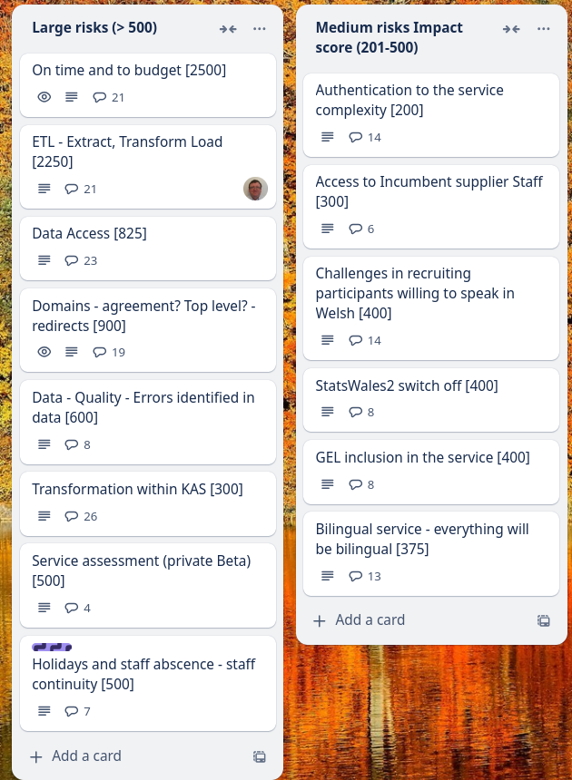

Weekly report
=============

Weighted Average
------------------------------

What we did last week
------------------------

- Iterate beta product roadmap beyond  mvp build
- Putting a large amount of text in the title of the dataset results in unhelpful message
- Metadata: Add a data source from the selected data provider lacks validation
- Metadata: Publisher organisation and contact
- Authenticate with MS EntraID [Won't fix]
- Metadata: Topics
- Suggested changes from metadata design review
- Provide a way for the user to log out from the frontend
- [SPIKE] Log in journey for private Beta
- Metadata: Sources added
- Metadata: Add a data source from the selected data provider
- Metadata: Add a data provider

What we're planning to do this week
-----------------------------------

- Explore the design of views with larger / more complex datasets
- Onboard MVP collaborators
- Handover from Register Dynamics
- Prepare to test the next iteration of working software (ref data and metadata) with SME publisher
- Deploy front-end and back-end applications into automated infrastructure
- Provide CSV data for time dimension testing
- Publishing: Translation export and import
- Dimensions: Choose common reference data
- Stand up the service in WG Azure
- Dimensions: Upload a lookup table
- Dimension: Measures

Goals
-----------------------------------

These are the goals that we set for this sprint:

- End to end automated testing _**In progress**_
- Deploy to WG infrastructure _**In progress**_
- Test the create journey ready for testing _**In progress**_
- Prepare for next round of consumer testing on views _**In progress**_
- Feasibility analysis - OData to structural model _**In progress**_

Risk and Issues
-------------------------------

Current table showing project Risks and Issues

Video of the most recent show and tell
--------------------------------------

[Show and Tell 12_12_2024](https://drive.google.com/file/d/1LtKtJrhg8kDu_F87TOZABuOP7VAatVud/view?usp=sharing)
