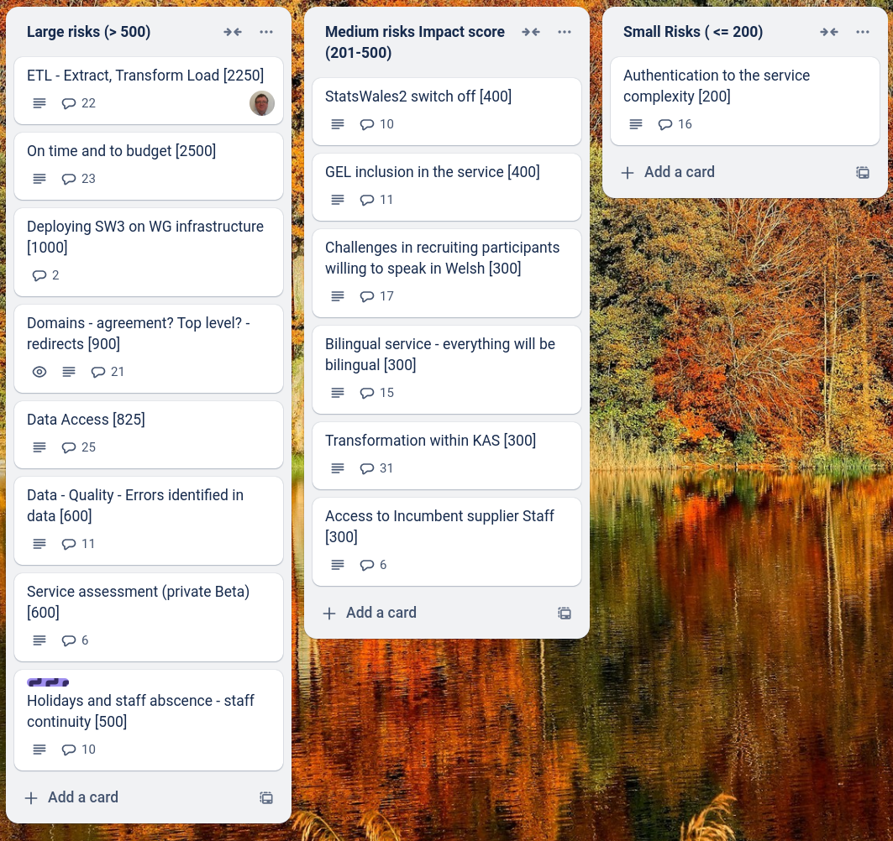
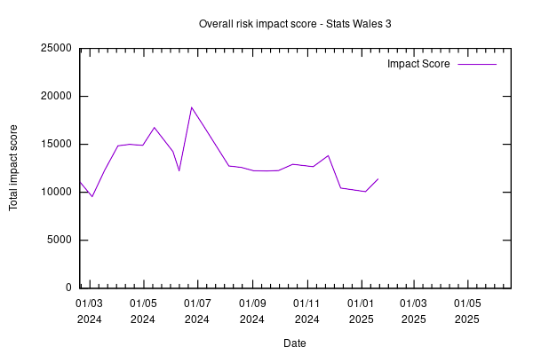

Weekly report
=============

The letter X
------------------------------

What we did last week
------------------------

- Prepare discussion guide for consumer testing
- Dataset removed from list of datasets and no longer available during creation
- Iterate error messages - create user journey
- Prototype WIMD dataset for consumer testing
- Content and error message updates to create journey screens

What we're planning to do this week
-----------------------------------

- Refine product roadmap and backlog
- Design first iteration Find a dataset by browsing categories (taxonomy)
- Schedule sessions with consumers to test viewing a dataset
- Prepare guide for unmoderated testing with publishers
- Complete testing of create journey with early testers
- Plan StatsWales away day in Cardiff (Marvell & WG teams)
- Handover from Register Dynamics
- Dimension: Name
- Capture audit of actions in the publishing system (MVP)
- Stand up the service in WG Azure

These are the goals that we set for this sprint
-----------------------------------------------

- Do "Low hanging fruit" on the create journey. _**In progress**_
- Implement update user journey _**In progress**_
- Migrate to WG estate _**In progress**_
- First consumer user testing session _**In progress**_

Screen shot of risks and issues board
-------------------------------------

Chart showing change in risk profile
------------------------------------

