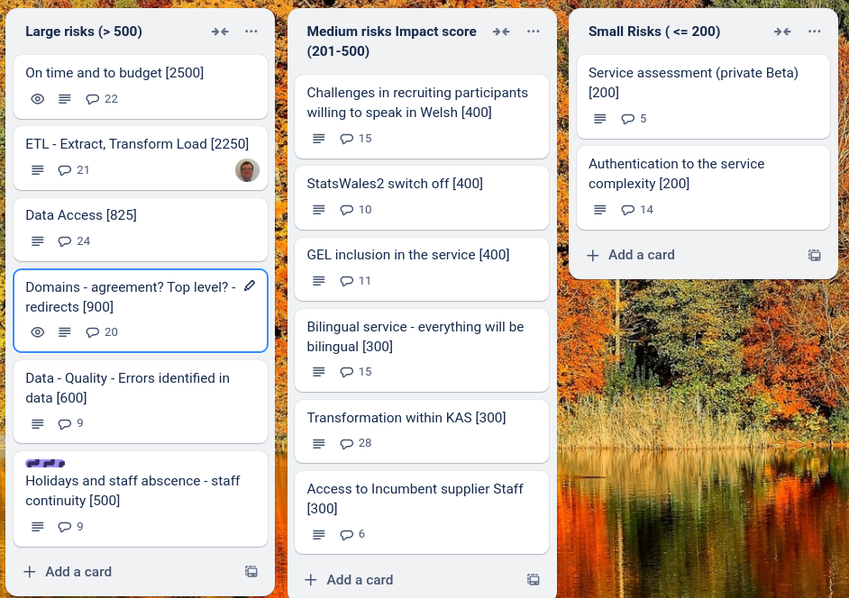
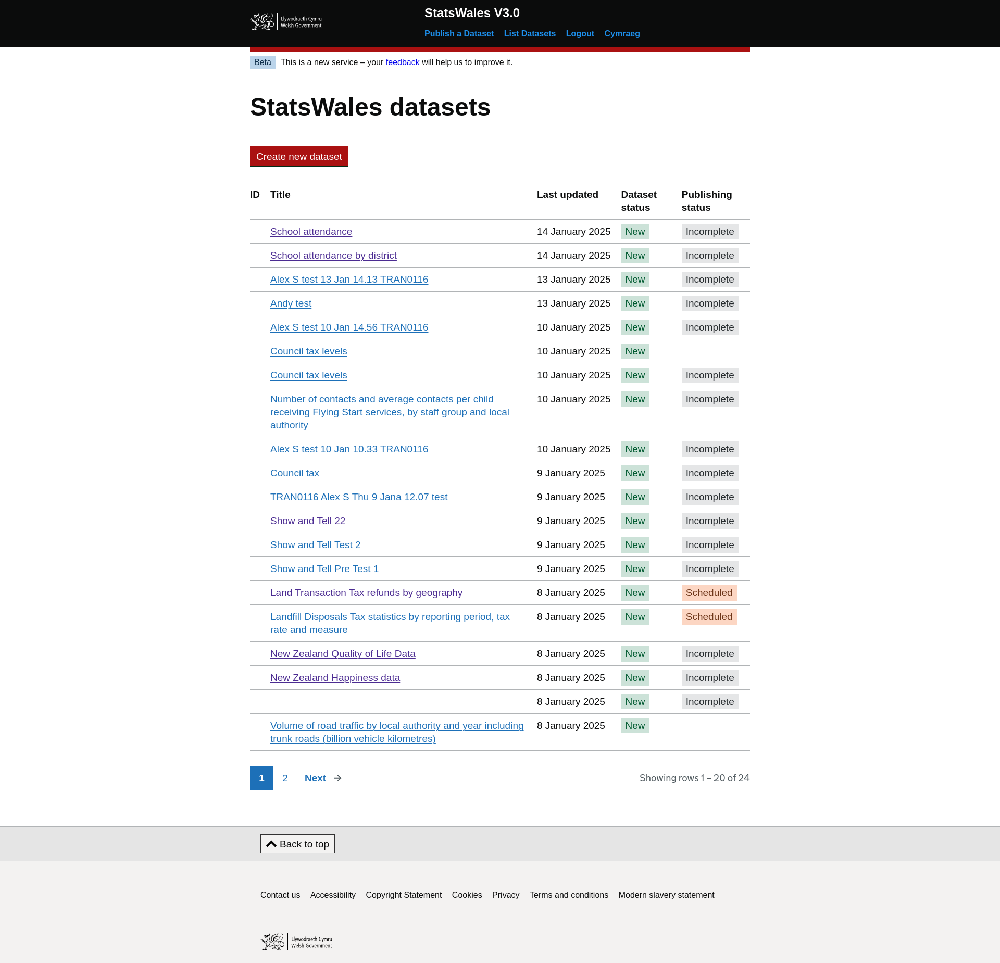
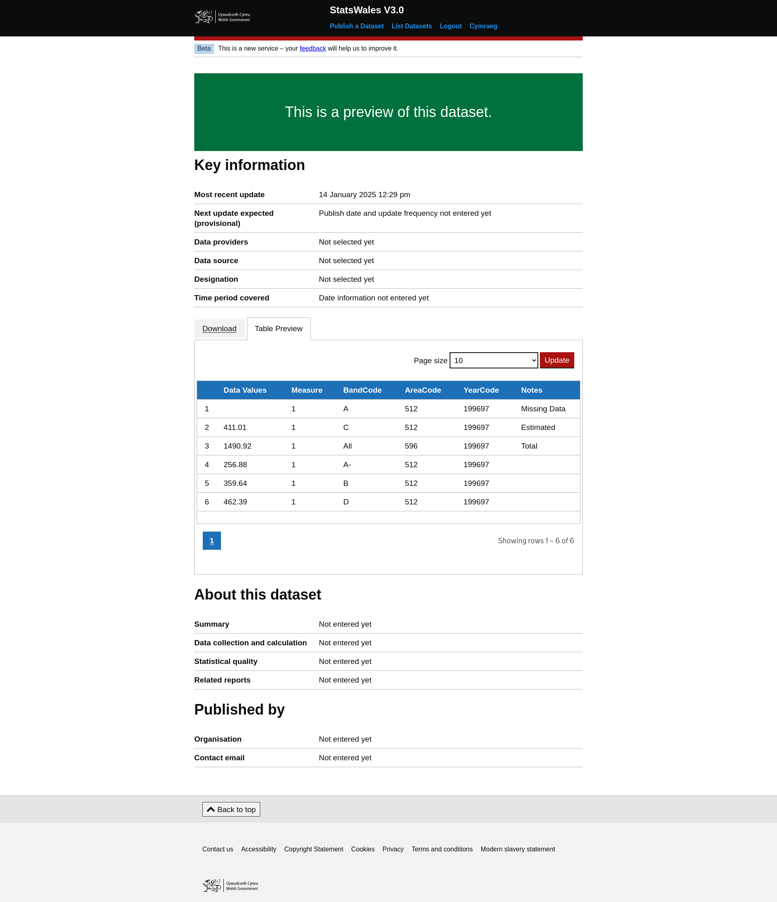

X-axis
=============

What we did last week
------------------------
- Prototype WIMD dataset for consumer testing
- Prototype HLTH dataset for consumer testing
- Deploy front-end and back-end applications into automated infrastructure
- Provide CSV data for time dimension testing
- Prototype HLTH dataset for consumer testing
- Review & iterate user needs board
- Publisher research - dataset design and consumer experience workshop 1
- Onboard MVP collaborators
- Prepare to test the next iteration of working software (ref data and metadata) with SME publisher
- Deploy front-end and back-end applications into automated infrastructure

What we're planning to do this week
-----------------------------------

- Refine product roadmap and backlog
- Prepare discussion guide for consumer testing
- Schedule sessions with consumers to test viewing a dataset
- Prepare guide for unmoderated testing with publishers
- Complete testing of create journey with early testers
- Prepare discussion guide for testing with consumers
- Schedule sessions with consumers
- Prepare guide for unmoderated testing with publishers
- Plan StatsWales away day in Cardiff (Marvell & WG teams)
- Handover from Register Dynamics
- Dimension: Name
- User authentication journey from EntraID to SW3  - scope for MVP
- Stand up the service in WG Azure

Goals
-----------------------------------

These are the goals that we set for this sprint:

- Do "Low hanging fruit" on the create journey. _**In progress**_
- Implement update user journey _**In progress**_
- MIgrate to WG estate _**In progress**_
- First consumer user testing session _**In progress**_

Risk and Issues
-------------------------------

Current table showing project Risks and Issues

Show and Tell from last week
----------------------------

[Show and tell 22 - 09 01 2025](https://drive.google.com/file/d/1AttWIARv3CYAjVsuR03nDNZ4dyFDAoKl/view?usp=sharing)

Screenshots from working software
---------------------------------

