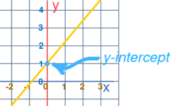
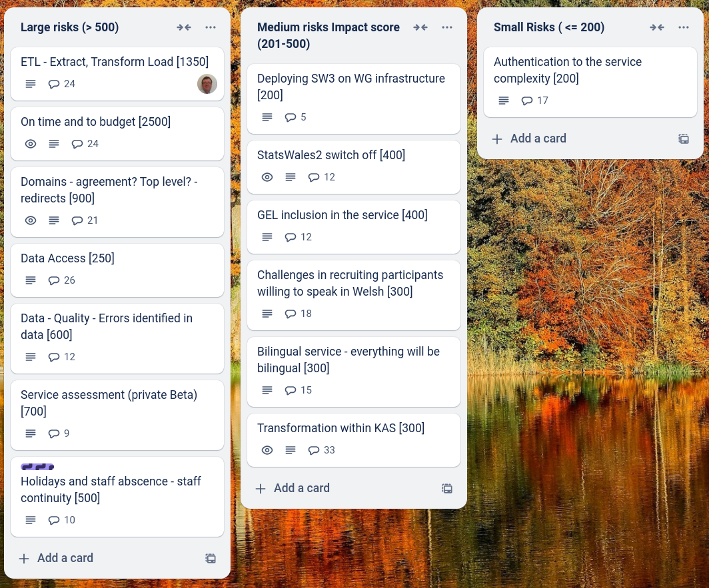
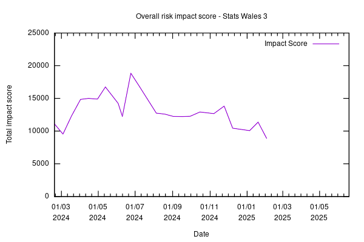

Weekly report
=============

The Y intercept 
------------------------------

What we did last week
------------------------

- Create facilitation guide for the event in Cardiff
- Permissions reqs / mapping
- Refine product roadmap and backlog
- Create journey complains at what appears to be a valid date
- Update a dataset - Update data table
- Stand up the service in WG Azure

What we're planning to do this week
-----------------------------------

- Move guidance route outside of auth
- The org / team assignment is not remembering what you selected
- Publisher dataset list is showing scheduled dataset as "Live" status
- Dataset preview: Related reports not pulling through
- Dataset preview: Data providers and sources not showing correctly
- Dataset preview: Next update expected (provisional) not showing when dataset won't be updated
- Organise testing of update a dataset
- Extract ZIP and CSV Data from Backoffice BACAC File
- Metadata: Cancel button missing from some screens
- Prepare guide for unmoderated testing with publishers
- Plan StatsWales away day in Cardiff (Marvell & WG teams)
- Change dataset after it has been set for publication
- Submit dataset for publication
- Handover from Register Dynamics
- User authentication journey from EntraID to SW3  - scope for MVP
- Dimension: Load reference data

These are the goals that we set for this sprint
-----------------------------------------------

- Update journey - working software _**In progress**_
- Complete consumer view - working software _**In progress**_
- Complete testing with consumers - testing _**In progress**_

Screen shot of risks and issues board
-------------------------------------

Chart showing change in risk profile
------------------------------------

