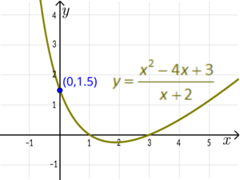
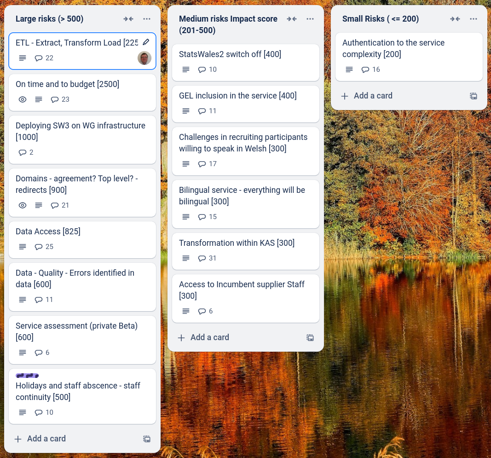
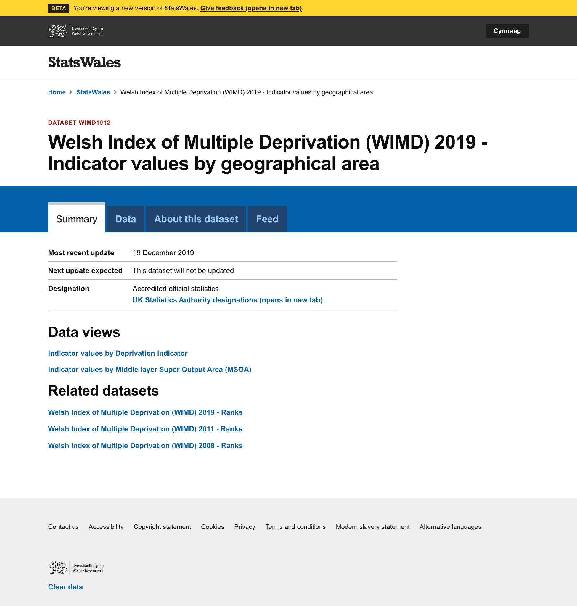
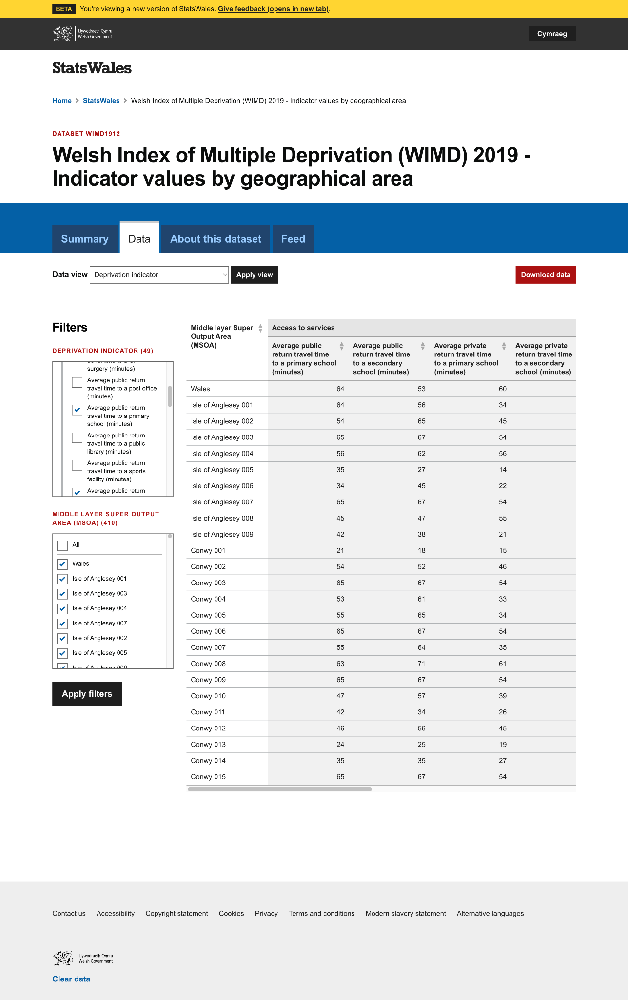

y-intercept
=============

What we did last week
------------------------

Run first set of round 3 consumer testing sessions
- Schedule sessions with consumers to test viewing a dataset
- Complete testing of create journey with early testers
- Publisher homepage / list of datasets
- Request support (via email)
- Provide support (via email) & set up Jira support board
- Capture audit of actions in the publishing system (MVP)
- Explore access permissions requirements
- Decide approach for 3 metadata fields currently not in design
- Content and error message updates to create journey screens
- Browse basic list of datasets - consumer view
- Publishing: Translation export and import

What we're planning to do this week
-----------------------------------

- Organise testing of update a dataset
- Complete consumer view testing sessions
- Refine product roadmap and backlog
- Plan StatsWales away day in Cardiff (Marvell & WG teams)
- Change dataset after it has been set for publication
- Handover from Register Dynamics
- Dimension: Name
- Update a dataset - Update data table
- Stand up the service in WG Azure

Goals
-----------------------------------

These are the goals that we set for this sprint:

- Update journey - working software _**In progress**_ 
- Complete consumer view - working software _**In progress**_
- Complete testing with consumers _**In progress**_

Risk and Issues
-------------------------------

Current table showing project Risks and Issues

Show and Tell from last week
----------------------------

[Show and tell 23 - 23 01 2025](https://drive.google.com/file/d/1_7Aj-kbXtspL1HxMWFiWhueWHZCRfE-X/view?usp=sharing)

Screenshots from consumer view design concepts
----------------------------------------------

### Summary

### View by dimension

### Filtered view

