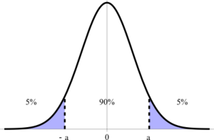
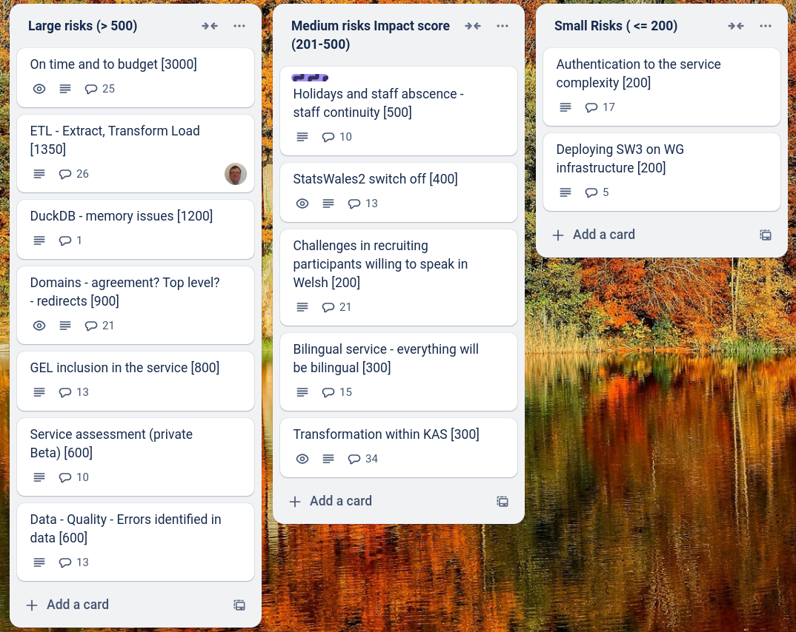
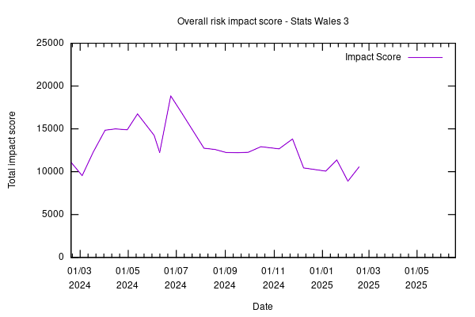

Weekly report
=============

Z hypothesis 
------------------------------

What we did last week
------------------------

- Performance improvements
- Translation import validation needs to ignore any extra rows in the CSV
- Remove redundant env vars in pipelines
- Dataset overview page status tags
- Hold SW3 private beta event in Cardiff and remotely
- Approval process mapping
- Temporary login workaround
- Create facilitation guide for the event in Cardiff
- Permissions reqs / mapping
- Permissions design / prototype - DUPLICATE
- Returning to column assignment from the tasklist duplicates dimensions
- Feedback form for publishers
- Stand up the service in WG Azure

What we're planning to do this week
-----------------------------------

- Flatten a Cube
- "Most recent update" is showing first published date and not most recent publish date
- Refine product roadmap and backlog
- Dimension: Name
- Create ETL migration plan document - draft for 26/02/2025 (ideally  much sooner)
- Dataset ID workshops
- Roles and permissions matrix
- Prototype permissions screens

These are the goals that we set for this sprint
-----------------------------------------------

- Hold successful in-person and on-line event in Cardiff _**Done**_
- Bug fixes and performance improvements on working software _**In progress**_
- Define priorities for public Beta _**Done**_
- Complete testing _**Done**_
- Define next steps for data consumer views_**In progress**_
- Domain for Beta  _**Done**_

Screen shot of risks and issues board
-------------------------------------

Chart showing change in risk profile
------------------------------------

