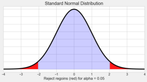
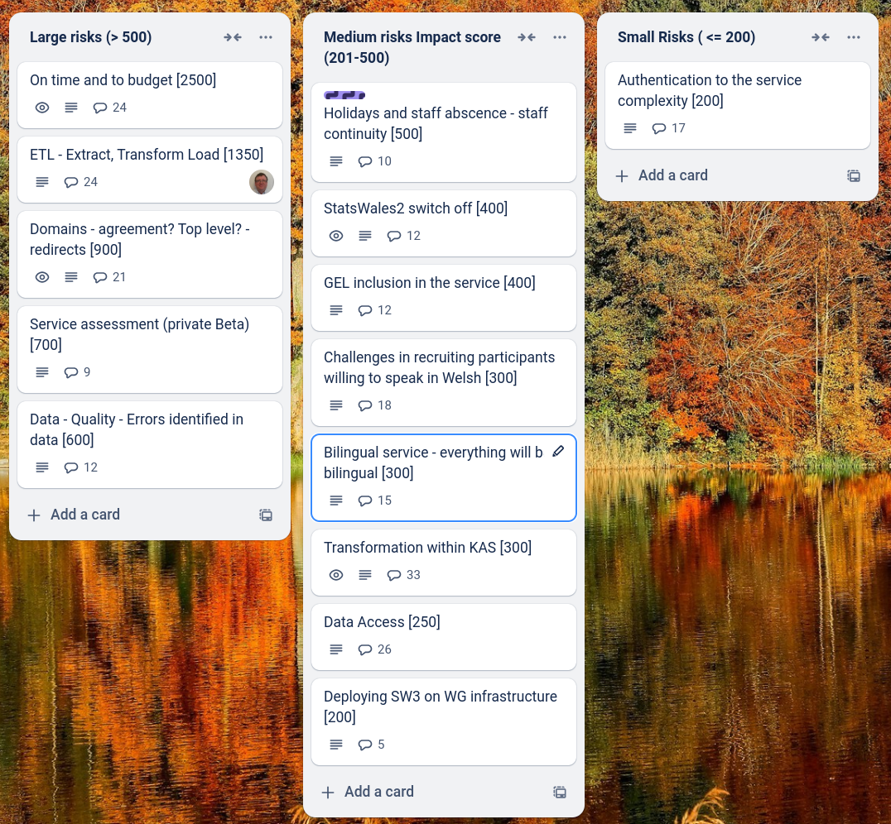

Z-test
=============

What we did last week
------------------------
- Performance improvements
- Translation import validation needs to ignore any extra rows in the CSV
- Hold SW3 private beta event in Cardiff and remotely
- Create facilitation guide for the event in Cardiff
- Broken test dataset
- Dataset preview: Rounding applied not appearing
- Complete consumer view testing sessions
- Preview pagination is broken
- Implement 'Guidance' link in the header
- Preview a dataset [MVP]
- Dimension: Implement time source
- Feedback form for publishers
- Dimension: Dates reference data branch
- Stand up the service in WG Azure
- Data domain model
- Dimensions: Upload a lookup table
- Dimension: Measures

What we're planning to do this week
-----------------------------------

- Approval process mapping
- Permissions reqs / mapping
- Refine product roadmap and backlog
- Dimension: Row sample text incorrect
- Set up dimensions containing time: Sample of rows is wrong
- Dimension: Name
- Stand up the service in WG Azure

Goals
-----------------------------------

These are the goals that we set for this sprint:

- Hold successful in-person and on-line event in Cardiff _**Done**_ 
- Bug fixes and performance improvements on working software _**In progress**_
- Define priorities for public Beta _**In progress**_
- Complete testing _**In progress**_
- Define next steps for data consumer views _**In progress**_
- Domain for Beta _**In progress**_

Risk and Issues
-------------------------------

Current table showing project Risks and Issues

Show and Tell from last week
----------------------------

[Show and tell 23 - 06 02 2025](https://drive.google.com/file/d/1VIuKiiOxv0v0fFMTJfcVDftiLi5n23WK/view?usp=sharing)

