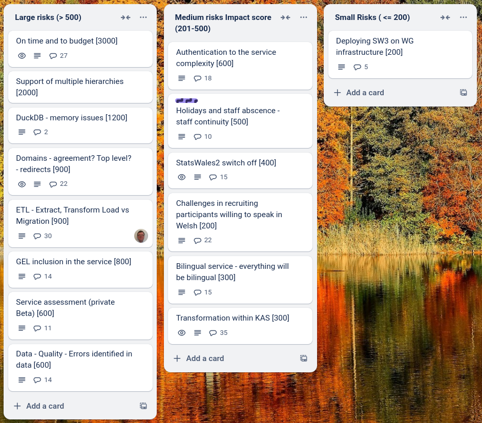

Weekly report
=============

Aardvark
------------------------------

What we did last week
------------------------

- Quarter format question - Radio button for '-x' not selectable
- Create SQLite Cube for testing and development
- Manage users and groups flows for admins
- Roles and permissions matrix
- Fill out Section 4. of the ETL document (Data Transformation)
- Error when a lookup CSV is not added and continue is clicked in update journey
- Data table upload only works in incognito mode
- Spaces in dimension headers in the data table
- Quarter format: Changing content following research findings
- Preview error 'We were unable to generate a preview of the uploaded CSV. Is this a valid CSV?'
- Dimension: Date reference branch - Not selecting a radio button throughout causes issues or incorrect error messages
- Measure: Clicking continue without adding a file takes you to “An unknown error occurred"
- Data table: Uploading a new/different data table does not remove all dimension data or reset status tags
- Measure lookup - System tried to join on wrong column
- Design first iteration Find a dataset by browsing categories (taxonomy)
- Two errors when matching data types but data table and data type lookup look right
- Dimension: Summary when clicking back into a dimension after reference data added
- Dimension: Name
- Download whole dataset as human readable CSV in English or Welsh
- Feedback form for publishers [unmoderated testing]
- Exploration into programmatic access with SW data consumers

What we're planning to do this week
-----------------------------------

- Create stimulus for permissions table top simulations
- Write responses or advise on responses to 11 Feb Cardiff event feedback
- Arrange permissions and publication management table top simulations
- [SPIKE] Test memory usage
- Implement improved status tags in the update user journey
- Metadata properties that don't need translation should show as complete for both languages
- Show blank cell for Welsh if dimension name not provided (was:Incorrect pre-population in exported translation file)
- Metadata/Translation: Related report link texts should be in translation export
- Design download whole dataset or manipulated dataset (consumer)
- Data table: Previously implemented summary and data table change screens no longer present
- Refine product roadmap and backlog
- Update a dataset - Update metadata

These are the goals that we set for this sprint
-----------------------------------------------

- First pass - application of GEL to the existing publishing Beta _**In progress**_
- Review ETL plan and agree next steps _**In progress**_
- Define approach for on-boarding publishers _**In progress**_

Screen shot of risks and issues board
-------------------------------------

Chart showing change in risk profile
------------------------------------

