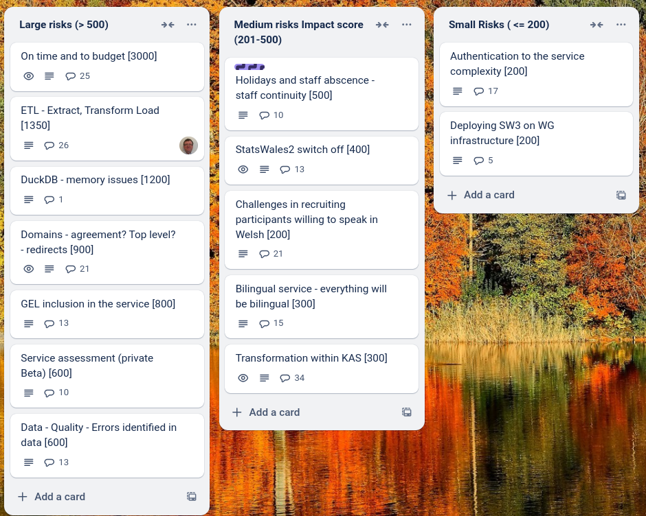

Aardvark
=============

What we did last week
------------------------
- Draft spec of dataset ID
- Hold dataset ID workshop
- Fill out Section 4. of the ETL document (Data Transformation)
- "Most recent update" is showing first published date and not most recent publish date
- Workshop / Discussion: What if measure types in the same dataset have different time periods?
- Guidance: Styling not pulling in govuk classes
- Permissions design / prototype - DUPLICATE
- Translate current working software into Welsh (end of Jan)
- Set up dimensions containing time: Sample of rows is wrong

What we're planning to do this week
-----------------------------------
- Arrange permissions and publication management table top simulations
- Roles and permissions matrix
- Metadata properties that don't need translation should show as complete for both languages
- Metadata/Translation: Related report link texts should be in translation export
- Refine product roadmap and backlog
- Dimension: Name
- Update a dataset - Update metadata

Goals
-----------------------------------

These are the goals that we set for this sprint:

- Arrange roles and permissions  testing sessions with publishers _**In progress**_
- First pass - application of GEL to the existing publishing Beta _**In progress**_
- Review ETL plan and agree next steps _**In progress**_
- Define approach for on-boarding publishers _**In progress**_

Risk and Issues
-------------------------------

Current table showing project Risks and Issues

Show and Tell from last week
----------------------------

[Show and tell 24 - 20 02 2025](https://drive.google.com/file/d/1h2kCeT6_64OxCdI6dHW1dqPfwyL4QfBw/view?usp=sharing)

