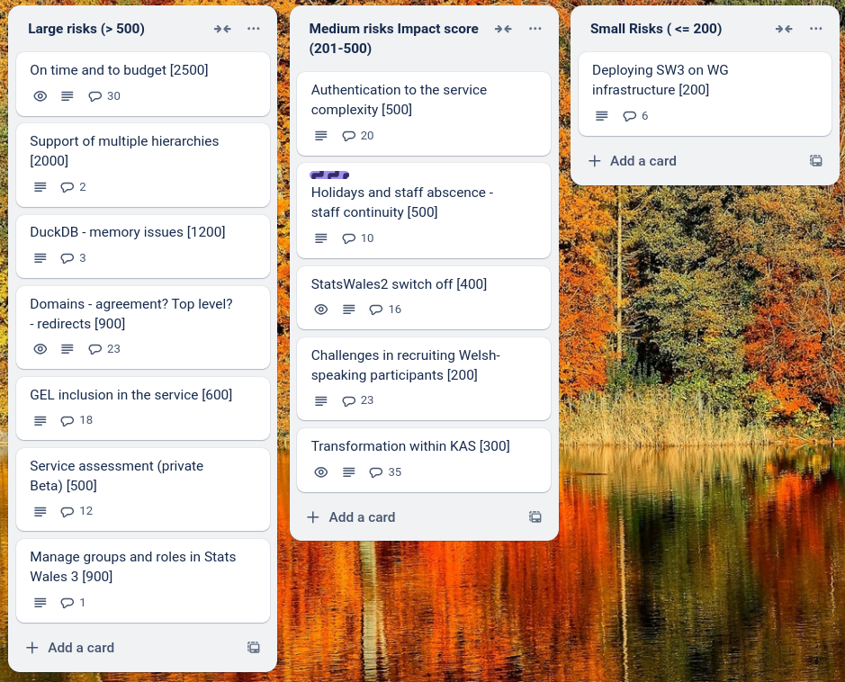
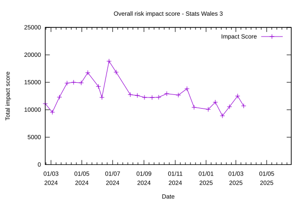

# Sprint 27-mid - Bat

## What we did last week

- "Dimension containing dates" option is missing
- Explore hierarchies in SW2 datasets
- Integrate health probes
- Exploration into managing permissions in EntraID
- 'An unknown error occurred, try again later' when uploaded amended data table
- Error and weird behaviours when replacing data table
- Write responses or advise on responses to 11 Feb Cardiff event feedback
- Arrange permissions and publication management table top simulations
- Workshop / Discussion: What if measure types in the same dataset have different time periods?
- Quarter format: Changing content following research findings
- Show blank cell for Welsh if dimension name not provided (was:Incorrect pre-population in exported translation file)
- Dimensions: Update content on mismatch screens
- Design download whole dataset or manipulated dataset (consumer)
- Data table: Previously implemented summary and data table change screens no longer present
- Choosing the default of percentage for a dataset causes and error
- Clicking on "Measure or datatype" results in "Page not found"
- Time questions in a loop when completed
- Gather information about SW2 datasets from OData to inform migration approach
- Create ETL migration report
- Update a dataset - Update metadata
- Update a dataset - Update data table
- Consumer view of dataset
- Apply GEL WG override CSS file to working software
- Dimensions: Choose common reference data

## What we're planning to do this week

- Explore how we might automate the pivoted views we have validated with consumers
- Provide a way for UX to run the full stack locally
- Update translations for first onboarding cohort
- Run permissions and publication management table top simulations
- Support onboarding of first cohort

## Goals

These are the goals that we set for this sprint:

- Onboard first cohort of Welsh-speaking publishers _**In progress**_
- Updated dimension flow - working software _**Done**_ 
- Implement health-probes for service  _**Done**_
- Preview environment running on EntraID - roles and permissions _**Done**_

## Risk and Issues

Current table showing project Risks and Issues:

## Risks Profile

Risk profile chart

