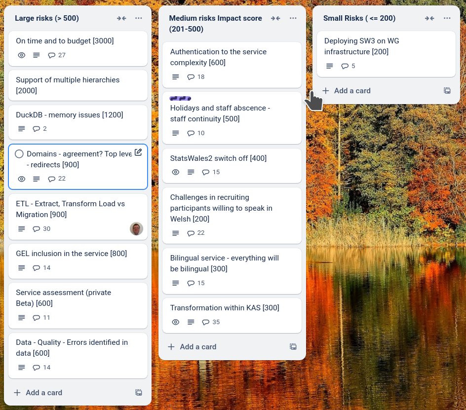

# Sprint 27 - Bat

## What we did last week

- Arrange session with web team
- Create stimulus for permissions table top simulations
- Manage users and groups flows for admins
- Develop feedback form that anon publishers with access needs can use
- Roles and permissions matrix
- Use English title in the dataset list views until the Welsh is provided
- Metadata properties that don't need translation should show as complete for both languages
- Remove all categories apart from geography from reference data in SW3
- Memory leak - showed up in S&T
- Metadata/Translation: Related report link texts should be in translation export
- Non functional testing strategy - timeline for accessibility / Welsh / penetration testing
- Refine product roadmap and backlog
- Lookup upload xlsx (unsupported file type) error
- 'Check the data table' page displays note code 't' as 'true'

## What we're planning to do this week

- Dimension type: Simplifying options and tweaking dimension flow
- Arrange permissions and publication management table top simulations
- Support onboarding of first cohort 
- Dimension: Name of dimension on every page in dimension flow

## Goals

These are the goals that we set for this sprint:

- Onboard first two Welsh-speaking publishers _**In progress**_
- Updated dimension flow - working software _**In progress**_
- Implemented health-probes for service  _**In progress**_
- Preview environment running on EntraID - roles and permissions _**In progress**_

## Risk and Issues

Current table showing project Risks and Issues:

## Show and Tell from last week

[Show and tell 26 - 06 03 2025](https://docs.google.com/presentation/d/1uwufa0GenPoybC7v_txMjFQZINmghbwYd0yObbxpFQY/edit?usp=sharing)

