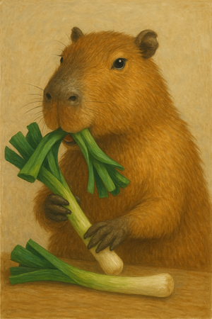
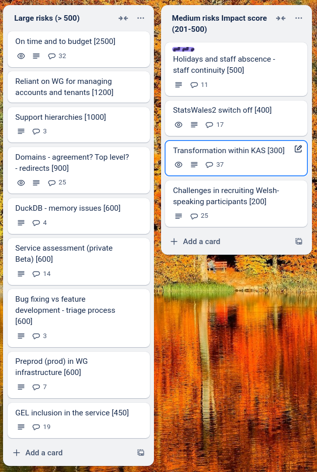
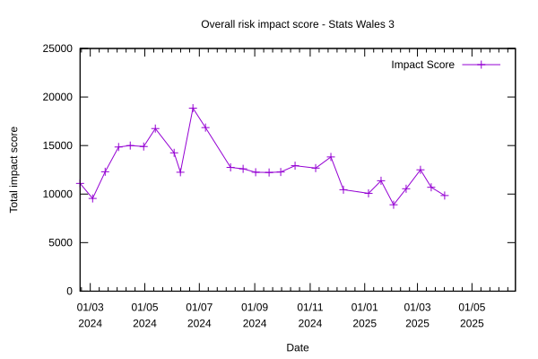

# Sprint 28 - Capybara

## What we did last week

- Analyse evidence from permissions workshops
- Create journey: data table cannot be amended in preview environment
- Dataset preview link is broken
- Dimension look ups 'page not found' in update user journey
- Make tasklist sidebar actions a list
- Add error message for users who try to reuse an exported translation file
- Updating - “Page not found” on measures task
- Add 'Management Information' to the list of designations
- First pass GEL fixes (SCSS files only)
- Delete a draft dataset (unpublished)
- Dimension type: Simplifying options and tweaking dimension flow
- Remove secondary buttons
- Page not found when submitting update for publishing without filling in publishing date
- Uploading the measures displays both languages on the first pass, but subsequently only shows current language
- Fix spacing between buttons
- Support onboarding of first cohort
- Create dev tickets for managing groups and user roles
- Implement improved status tags in the update user journey
- Dimension: Name of dimension on every page in dimension flow
- Check the lookup table: weird symbols in Welsh description
- Translation: Export file has uploaded dimension names populated in Welsh column
- Errors that are corrected by refreshing
- Design first iteration Find a dataset by browsing categories (taxonomy)
- Problems going back in date matching - periods of time
- Implement RBAC (role-based access control)

## What we're planning to do this week

- Document patterns and components
- Implement Add user
- Engage with gov.wales statistics and research team
- Fix StatsCymru logo and favicon
- Create Pivot Table queries in SQLite using a new cube
- Update translations for first onboarding cohort
- SPIKE: Pivot by dimension
- Explore designs for viewing hierarchies

## Goals

These are the goals that we set for this sprint:
- First iteration of consumer view _**In progress**_
- Delete dataset _**In progress**_
- Get feedback on create a dataset from first cohort _**In progress**_
- Progress exploration of hierarchies and pivot tables. _**In progress**_

## Risk and Issues

Current table showing project Risks and Issues:

Total risk impact over time

