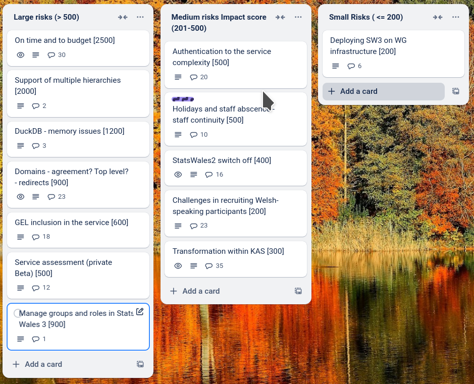

# Sprint 28 - Capybara

## What we did last week

- Create journey: data table cannot be amended in preview environment
- Dataset preview link is broken
- Dataset preview does not work
- Dimension look ups 'page not found' in update user journey
- Add error message for users who try to reuse an exported translation file
- Measure link in task list doesn't change when the measure name has been updated.
- Missing H1 on dataset overview page
- Missing H1 from dataset preview page
- First pass GEL fixes (component work)
- Updating - “Page not found” on measures task 
- Provide a way for UX to run the full stack locally
- Explore hierarchies in SW2 datasets
- Delete a draft dataset (unpublished)
- Set up deployment of the SW3 app in the WG estate for onboarding publishers
- Dimension type: Simplifying options and tweaking dimension flow
- Wrong format look up table throws unhelpful error message
- Dimension name: Error states not triggering
- Run permissions and publication management table top simulations
- Download links on the consumer view of the dataset are broken
- Replacing a table with one with fewer columns
- Data values show incorrectly in preview
- Dimension: Name of dimension on every page in dimension flow
- Cube builder seems to rely on sort order of dimensions or fact table info
- Check the lookup table: weird symbols in Welsh description
- Translation: Export file has uploaded dimension names populated in Welsh column
- Dataset preview: Time period covered styling and year type not present
- Errors that are corrected by refreshing
- Problems going back in date matching - periods of time 
- Implement RBAC (role-based access control)

## What we're planning to do this week

- Implement Add a group
- Fix StatsCymru logo and favicon
- Create Pivot Table queries in SQLite using a new cube
- Update translations for first onboarding cohort
- Support onboarding of first cohort
- Create dev tickets for managing groups and user roles
- 'Unknown error' when wrong lookup for data type is uploaded
- Explore designs for viewing hierarchies

## Goals

These are the goals that we set for this sprint:

- First iteration of consumer view _**In progress**_
- Delete dataset _**In progress**_
- Get feedback on create a dataset from first cohort _**In progress**_
- Progress exploration of hierarchies and pivot tables. _**In progress**_

## Risk and Issues

Current table showing project Risks and Issues:

## Show and Tell from last week

[Show and tell 28 - 20 03 2025](https://drive.google.com/file/d/1Wm_dfUrxPm_qzQDTDP5mll3YJRcz3gzD/view?usp=sharing)

