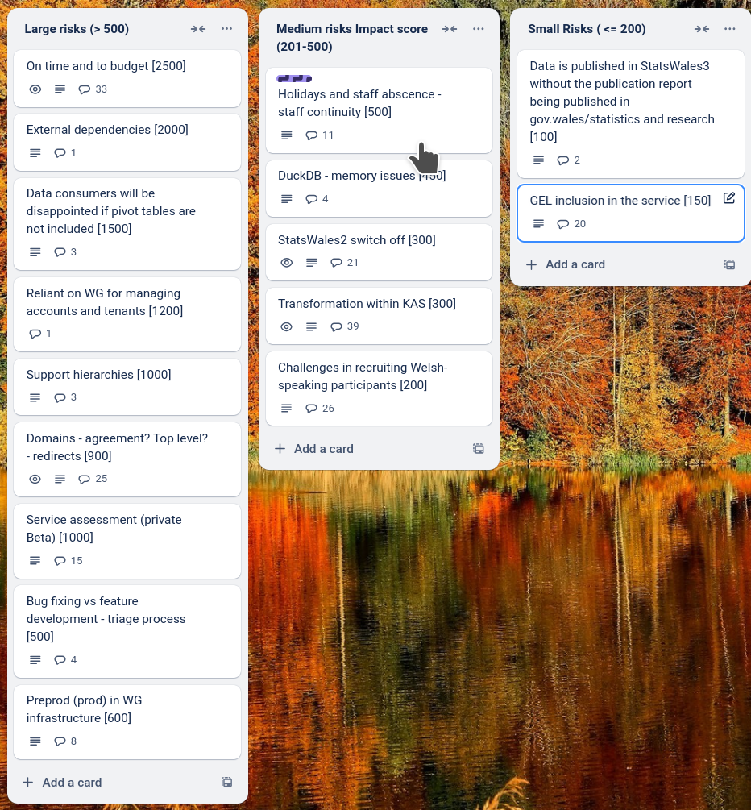

# Sprint 29 Mid - Donkey

## What we did last week

- Related links not included in translation status logic
- Design table sort (cancelling a selected sort)
- Design review tasks for add and update users SW-585 and SW-586
- Stale translations exports should be marked as such
- Change link on translation export should go straight to change name for dimensions
- errors.csv.unknown error in lookup table
- Onboard second cohort of publishers
- Change group details
- Implement Add a group
- Analyse evidence from permissions workshops
- Measure look up preview is different than expected
- Fix StatsCymru logo and favicon
- Explore hierarchies in SW2 datasets
- Determine whether we need to retain existing cube ID format, and how and when we will generate cube IDs

## What we're planning to do this week

- Prepare and submit info for GEL QA (publisher side)
- Summarise outputs for the implementation of hybrid pivot tables and hierarchies.
- Plan consumer recruitment for end-to-end mvp beta testing
- Write tests for existing code to improve test coverage
- Gather user scenarios for using pivot tables and hierarchies
- Give devs access to to prod / prepod envs
- Create a prod / preprod environment
- Permission denied page
- Analyse feedback from first onboarding cohort
- Dimension: Row sample text incorrect
- Configure a suitable testing suite for e2e tests

## Goals

These are the goals that we set for this sprint:

- Address issues so that second cohort of publishers can be onboarded _**In progress**_
- Complete minimal implementation of consumer data view _**In progress**_
- Conclude exploration around pivot tables and hierarchies _**In progress**_
- Roles and permissions - add and remove users from groups with roles _**In progress**_

## Risk and Issues

Current table showing project Risks and Issues:

Risk impact chart 

