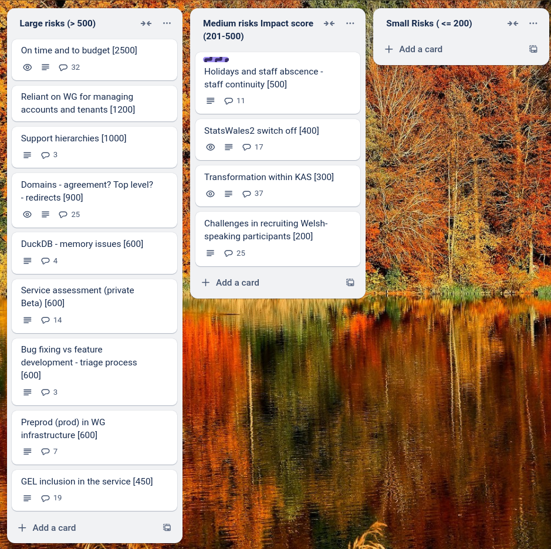

# Sprint 29 - Donkey

## What we did last week

- Duplication of rows in publisher-only preview
- Plan second cohort for publisher onboarding
- Document patterns and components
- 'errors.csv.unknown' when matching measure lookup
- Design / prototype journey for temporarily un-publishing dataset
- Design / prototype journey for archiving dataset
- Months for date formatting errors out with Tax year
- Design / prototype approve/reject journey
- Add ‘Medr’ to the list of publisher organisations
- Page not found for all dimensions following upload of data table
- Change group details
- Implement Add a group
- Dimension look ups 'page not found' in update user journey
- Engage with gov.wales statistics and research team
- Highlight "Home" and "Guidance" nav items when on the respective page
- Explore Data lake APIs for sorting and filtering a Parquet file
- Add error message for users who try to reuse an exported translation file
- Comms with participants in migration workstream following ETL decision
- Partly incorrect error message - date formatting cannot be matched to a dimension
- Page not found when submitting update for publishing without filling in publishing date
- Uploading the measures displays both languages on the first pass, but subsequently only shows current language
- Fix spacing between buttons
- [SPIKE] Test memory usage - perform load tests to understand usage
- Check the lookup table: weird symbols in Welsh description
- Translation: Export file has uploaded dimension names populated in Welsh column
- Errors that are corrected by refreshing
- Dimension containing dates: Year included in summary for quarterly data without yearly totals in it
- 'Unknown error' when wrong lookup for data type is uploaded
- Problems after date matching [FIX THIS]
- Problems going back in date matching - periods of time [FIX THIS]
- Implement RBAC (role-based access control)

## What we're planning to do this week

- Design archived dataset (consumer side)
- Onboard second cohort of publishers
- Plan consumer recruitment for end-to-end mvp beta testing
- Design review changes from groups - SW-582 and 584
- Gather user scenarios for using pivot tables and hierarchies
- Analyse feedback from first onboarding cohort
- Improve post-completion preview of translations
- Dimension: Row sample text incorrect
- Explore designs for viewing hierarchies

## Goals

These are the goals that we set for this sprint:

- Address issues so that second cohort of publishers can be onboarded _**In progress**_
- Complete minimal implementation of consumer data view _**In progress**_
- Conclude exploration around pivot tables and hierarchies _**In progress**_
- Roles and permissions - add and remove users from groups with roles _**In progress**_

## Risk and Issues

Current table showing project Risks and Issues:

## Show and Tell from last week

[Show and tell 29 - 03 04 2025](https://drive.google.com/file/d/1fiaHIkx10ow10o0Yeaijo0MH_w1uVsOE/view?usp=sharing)

