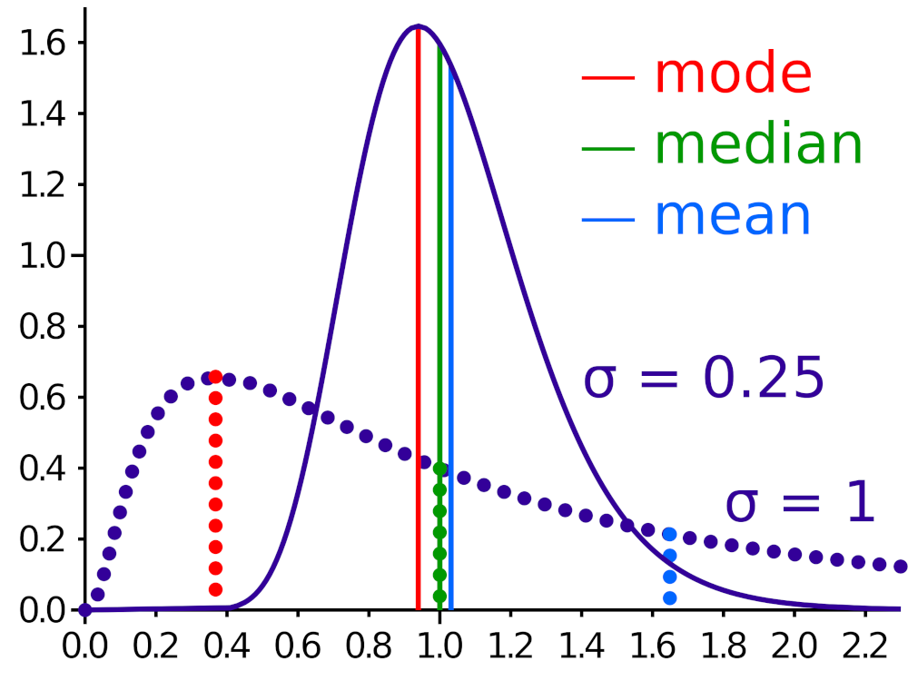
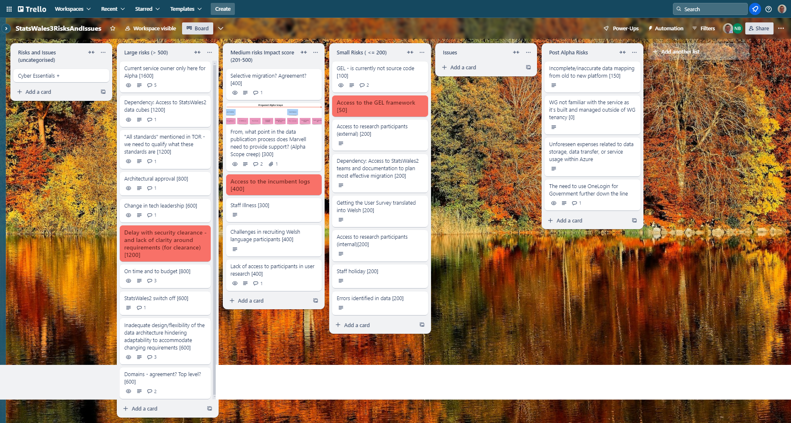

## What we did last week
- Disseminate the survey to the data publishers
- Define concepts for prototype testing
- Recruit participants for testing the alpha prototype
- Session to look at current product analytics
- Upload data to a data lake (includes Demo)
- Start conducting remote usability testing of our prototypes - data processors

## What we're planning to do this week
- Automate infrastructure as code for publishing app
- Analyse survey data from data processors
- Develop prototypes
- Access for full data cubes for Statswales2
- Start conducting remote usability testing of our prototypes - data consumers

## Goals
These are the goals that we agreed in planning:
- Analyse the findings from data processors and data consumers (research and design) _**In progress**_
- Create metadata database and link to assets in data lake (data and development) _**In progress**_

## Things to bear in mind / What's blocking us
Currently two things are limiting our progress and are identified as large risks
- Cyber essentials plus certification
- Assess to Stats Wales Data cubes

## Screen shot of risks and issues board

