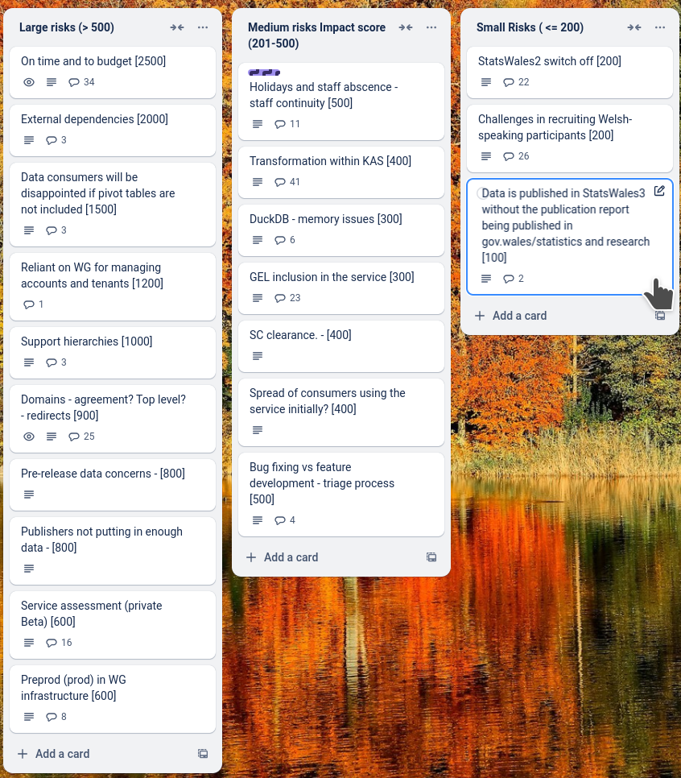
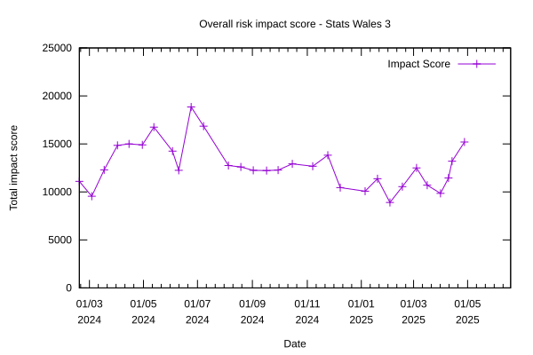

# Sprint 30 - Echidna

## What we did last week

- feature: Add revision.created_by to developer view
- feature: Remove Publisher organisation and contact
- feature: Permission denied page
- task: Reference data policy questions
- task: Prepare bi-lingual consumer screener and email
- fix: Error when trying to add custom lookup file
- fix: Data table summary error and dimension tasks fail
- fix: Session properties are not namespaced so apply across all datasets

## What we're planning to do this week

- feature: Approve a dataset
- task: Update guidance to explain that translation file is specific to version of dataset
- task: Plan data table only consumer testing
- task: Prepare discussion guide and testing materials for consumer testing
- task: Get reference data
- task: Prepare and submit info for GEL QA (publisher side)
- task: Summarise outputs for the implementation of hybrid pivot tables and hierarchies.
- task: Write tests for existing code to improve test coverage
- task: Give devs access to to prod / prepod envs
- task: Create a prod / preprod environment
- task: Analyse feedback from first onboarding cohort
- task: Configure a suitable testing suite for e2e tests
- fix: Dimension name AreaCode not included in the exported file
- fix: Dataset created in English not exporting all English dimension names
- fix: Add background styling to all form pages
- fix: Fix back to top button styling

## Goals

These are the goals that we set for this sprint:

- First iteration of consumer view _**In progress**_
- First iteration of approval journey _**In progress**_
- Agreement on approach to pivot table and hierarchies _**In progress**_
- Ready to screen consumers for user testing _**In progress**_

## Risk and Issues

Current table showing project Risks and Issues:

## Risks and Issues Impact Chart

