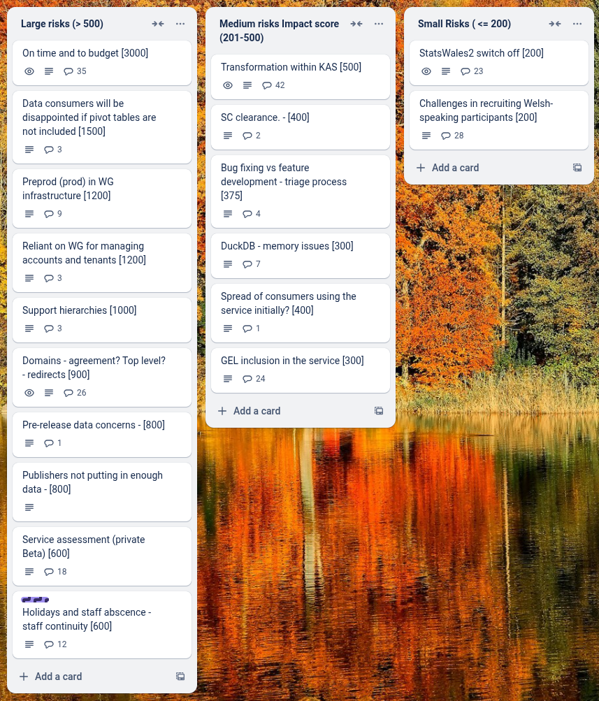
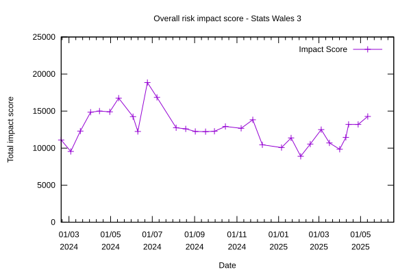

# Sprint 31 Mid - Flying Squirrel

## What we did last week

- task: Review and tidy questions, assumptions and decisions log
- task: Update to-be service map
- task: Onboard publishers cohort 3
- task: Plan third cohort for publisher onboarding
- task: Prepare and submit info for GEL QA (publisher side)
- task: Analyse feedback from first onboarding cohort
- fix: errors.csv.unknown for some but not all dimension tasks 
- fix: errors.csv.unknown error on dimension task
- fix: Page not found when click Submit for publishing but all tasks complete
- fix: Investigate timeouts and improve performance for the publishing journey
- fix: Errors.sources.assign_failed when matching columns in data table
- fix: Error message on data table view and dimensions when trying to upload a look up table
- fix: Cube could not be generated 
- fix: Dataset won't publish even though all create tasks completed 
- fix: Dimension name AreaCode not included in the exported file
- fix: Dataset created in English not exporting all English dimension names
- fix: Data table NaN error
- fix: Related links missing translations not included in translation status logic
- fix: Stale translations exports should be marked as incomplete in the export section

## What we're planning to do this week

- feature: Filters first iteration: Non Javascript version
- task: Iterate solution design document to include service optimisation details and latest solution
- task: Plan data table only consumer testing
- task: Prepare discussion guide and testing materials for end-to-end consumer testing
- task: Get reference data
- task: Summarise outputs for the implementation of hybrid pivot tables and hierarchies.
- task: Write tests for existing code to improve test coverage
- task: Map the landscape of data services in Wales
- task: Agree next steps for generating pivots when datasets are ready for publishing
- task: Change builds to use WG and github trigger via PAT
- task: Give devs access to to prod / prepod envs
- task: Create a prod / preprod environment
- task: Arrange final dataset design workshop with publishers
- task: Run Welsh language testing with publishers
- fix: Fix table styling
- fix: Fix preview tab styling

## Goals

These are the goals that we set for this sprint:

- Working filtering implementation _**In progress**_
- Onboard the 3rd Cohort of Publishers _**In progress**_
- Prepare for consumer testing _**In progress**_

## Risk and Issues

Current table showing project Risks and Issues:

Chart showing impact score

