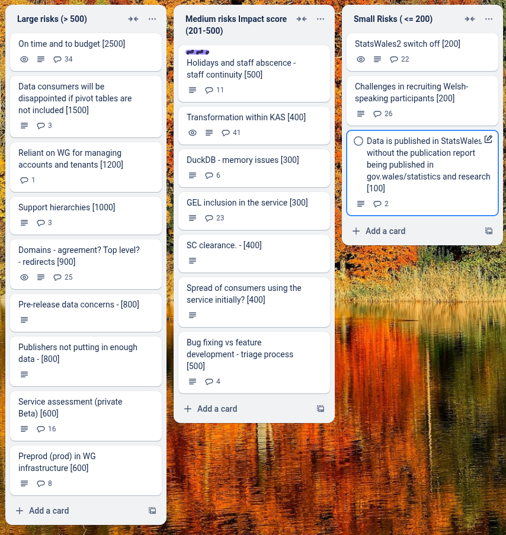

# Sprint 31 - Flying Squirrel

## What we did last week

- feature: Metadata page iteration
- feature: Add standardised notes (cell, data value level)
- task: Plan third cohort for publisher onboarding
- task: Update guidance to explain that translation file is specific to version of dataset
- task: Prepare and submit info for GEL QA (publisher side)
- task: Plan second cohort for publisher onboarding
- task: Communicate to publishers the transformation of their lookup tables in preview
- task: Configure a suitable testing suite for e2e tests
- fix: Errors.sources.assign_failed when matching columns in data table
- fix: Make user email addresses case-insensitive (for sign in)
- fix: Error message on data table view and dimensions when trying to upload a look up table
- fix: Cube could not be generated [SCHS0333]
- fix: Dataset won't publish even though all create tasks completed [Thomas Rose, educ0193]
- fix: Data table NaN error
- fix: Publishing date needs to account for timezone at time of publication
- fix: Forced to do translations in update even though metadata is unchanged
- fix: Create a Date field and then clicking on it in page not found

## What we're planning to do this week

- feature: On dataset overview, "Continue..." link should be first on list
- feature: Map the landscape of data services in Wales
- feature: Filters first iteration: Non Javascript version
- task: Plan data table only consumer testing
- task: Prepare discussion guide and testing materials for end-to-end consumer testing
- task: Get reference data
- task: Summarise outputs for the implementation of hybrid pivot tables and hierarchies.
- task: Write tests for existing code to improve test coverage
- task: Change builds to use WG and github trigger via PAT
- task: Give devs access to to prod / prepod envs
- task: Create a prod / preprod environment
- task: Analyse feedback from first onboarding cohort
- task: Arrange final dataset design workshop with publishers
- task: Run Welsh language testing with publishers
- fix: Investigate timeouts and improve performance for the publishing journey
- fix: Fix back to top button styling

## Goals

These are the goals that we set for this sprint:

- Working filtering implementation _**In progress**_
- Onboard the 3rd Cohort of Publishers _**In progress**_
- Prepare for consumer testing _**In progress**_

## Risk and Issues

Current table showing project Risks and Issues:

## Show and Tell from last week

[Show and tell 31 - 01 05 2025](https://drive.google.com/file/d/1g73X1mFF3EiuXQJl2-Kwu-VnEh6dW3FS/view?usp=sharing)

