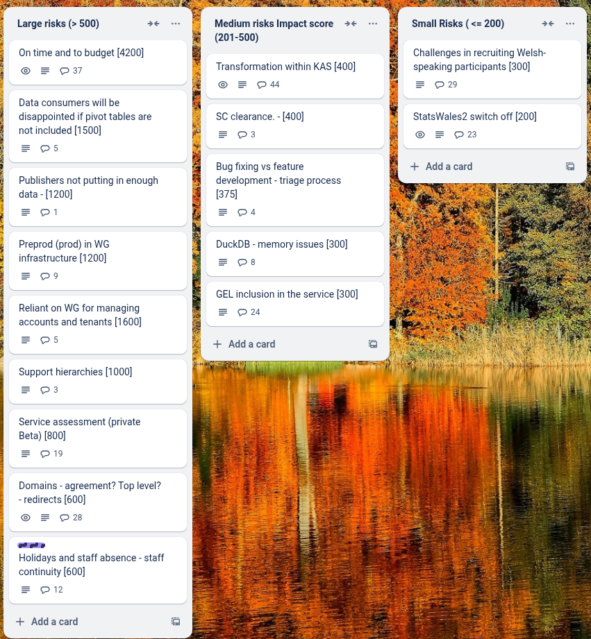
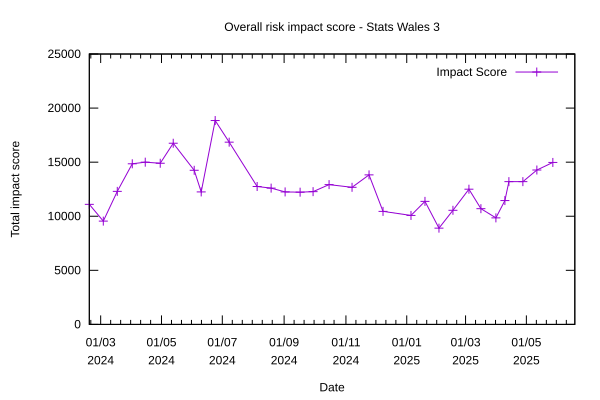

# Sprint 32-mid - Gecko

## What we did last week

- feature: Flatten a Cube
- feature: Investigate how much data we actually have.
- task: Start onboarded publishers cohort 3 first task
- task: Update create / update user flow map
- task: Reference data policy questions
- task: Map the landscape of data services in Wales
- task: Explore how we might automate the pivoted views we have validated with consumers
- task: Create Pivot Table queries in SQLite using a new cube
- task: Create Pivot Table queries in SQLite
- task: SPIKE: Pivot by dimension
- fix: Row numbers missing on preview and published datatable view
- fix: request_data_provider_url missing in translation link on data-providers page
- fix: An unknown error occurred, try again later with preview
- fix: Cube could not be generated in Table preview 
- fix: Page not found when try to submit for publishing 
- fix: Translation tasks go incomplete then when CSV exported again they show as complete
- fix: Table previews don't work on multiple datasets when only some of the data tasks are completed
- fix: Using back button shows cached version of tasklist page so may show a completed task as incomplete

## What we're planning to do this week

- feature: Implement find a dataset by browsing taxonomy
- feature: Filters first iteration: Non Javascript version
- task: Onboard KAS admin for publishers onboarding support
- task: Onboard publishers cohort 4
- task: Plan data table only consumer testing
- task: Prepare discussion guide and testing materials for end-to-end consumer testing
- task: Get reference data
- task: Write tests for existing code to improve test coverage
- task: Change builds to use WG and github trigger via PAT
- task: Give devs access to to prod / prepod envs
- task: Create a prod / preprod environment
- task: Run Welsh language testing with publishers
- task: Make our container images more secure
- fix: replace instances of javascript:history:back
- fix: Preview does not work - columns have been ignored

## Goals

These are the goals that we set for this sprint:

- Implement filtering and sorting for consumers _**In progress**_
- Start consumer testing _**In progress**_
- Approve a dataset _**In progress**_
- Get acceptance of a solution design document _**In progress**_
- Prepare for on-boarding of fourth cohort of publishers _**In progress**_

## Risk and Issues

Current table showing project Risks and Issues:

## Risk profile score

